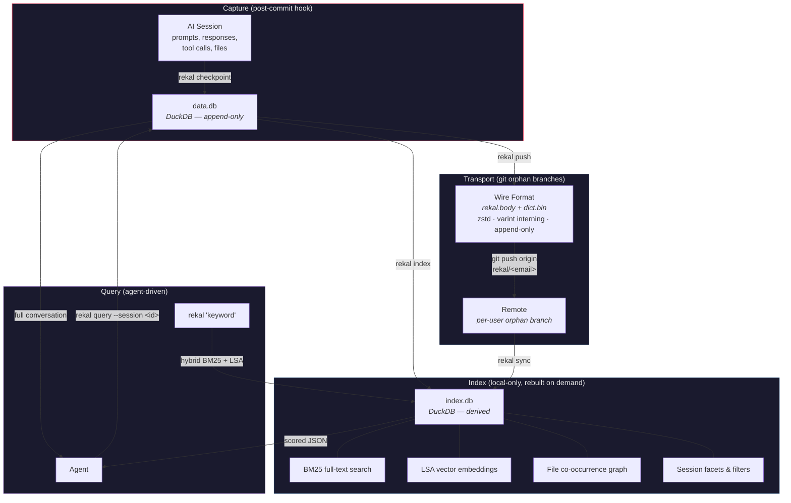

# Rekal

> **Beta** — Works with Claude Code. Expect breaking changes.

Rekal gives your AI agent precise memory — the exact context it needs for what it is working on, across your entire team. It hooks into git, captures session context at every commit, and makes it a permanent, queryable part of your project's history.

Your agent starts every session knowing *why* the code looks the way it does.

## Table of Contents

- [What Makes Rekal Different](#what-makes-rekal-different)
- [How It Works](#how-it-works)
- [Quick Start](#quick-start)
- [Commands Reference](#commands-reference)
- [Typical Workflow](#typical-workflow)
- [Architecture](#architecture)
- [Benchmarks](#benchmarks)
- [Development](#development)
- [Getting Help](#getting-help)
- [License](#license)

## What Makes Rekal Different

- **Security first** — Everything stays local. Nothing leaves the boundaries of git. No external services, no cloud APIs, no telemetry. A single binary with zero runtime dependencies beyond git itself.
- **Immutable by design** — Session snapshots are append-only. Content-hash deduplication means two developers always write to disjoint rows — merge conflicts are structurally impossible. Rekal never updates or deletes a session row.
- **Team-shared memory** — `rekal push` and `rekal sync` share session context across your entire team through git. Every developer's agent benefits from every other developer's prior sessions.
- **Git-native** — No external infrastructure. Rekal data lives on standard orphan branches, syncs through your existing remote, and uses git's object store for point-in-time recovery. Every checkpoint is anchored to a commit SHA.
- **DuckDB-powered** — Full-text search (BM25), LSA vector embeddings, and file co-occurrence graphs built on DuckDB. The index is local-only and rebuilt on demand from the shared data.
- **Agent-first** — Progressive context loading. `rekal <query>` returns scored snippets and metadata — just enough for the agent to decide what matters. `rekal query --session <id>` drills into a specific session for full turns. The agent controls how much context it loads.
- **Signal, not bulk** — A 2-10 MB session file becomes a ~300 byte payload. The wire format is a custom binary codec with zstd compression, string interning via varint references, and append-only framing.

## How It Works



When you commit, Rekal automatically snapshots your active AI session into a local DuckDB database. `rekal push` shares it with your team on a per-user orphan branch — your git history stays clean.

## Requirements

- Git
- macOS or Linux

## Quick Start

```bash
# Install
curl -fsSL https://raw.githubusercontent.com/rekal-dev/cli/main/scripts/install.sh | bash

```

Install location: `~/.local/bin` (override with `REKAL_INSTALL_DIR`).

```bash
# Initialize in a git repo
cd your-project
rekal init

# Check version
rekal version
```

When a newer release is available, the CLI prints an update notice after each command.

## Commands Reference

| Command | Description |
|---------|-------------|
| `rekal init` | Initialize Rekal in the current git repository |
| `rekal clean` | Remove Rekal setup from this repository (local only) |
| `rekal version` | Print the CLI version |
| `rekal checkpoint` | Capture the current session after a commit |
| `rekal push [--force]` | Push Rekal data to the remote branch |
| `rekal sync [--self]` | Sync team context from remote rekal branches |
| `rekal index` | Rebuild the index DB from the data DB |
| `rekal log [--limit N]` | Show recent checkpoints |
| `rekal [filters...] [query]` | Recall — hybrid search (BM25 + LSA) over sessions |
| `rekal query --session <id> [--full]` | Drill into a session (turns, tool calls, files) |
| `rekal query "<sql>" [--index]` | Run raw SQL against the data or index DB |

### Recall Filters (root command)

| Flag | Description |
|------|-------------|
| `--file <regex>` | Filter by file path (regex, git-root-relative) |
| `--commit <sha>` | Filter by git commit SHA |
| `--checkpoint <ref>` | Query as of a checkpoint ref on the rekal branch |
| `--author <email>` | Filter by author email |
| `--actor <human\|agent>` | Filter by actor type |
| `-n`, `--limit <n>` | Max results (default: 20, 0 = no limit) |

### Examples

```bash
rekal init                              # Set up Rekal in your repo
rekal checkpoint                        # Capture current session
rekal push                              # Share context with the team
rekal sync                              # Pull team context
rekal sync --self                       # Pull your own context from another machine
rekal log                               # Show recent checkpoints
rekal "JWT expiry"                      # Recall sessions mentioning JWT
rekal --file src/auth/ "token refresh"  # Recall with file filter
rekal --actor agent "migration"         # Show only agent-initiated sessions
rekal query --session 01JNQX...        # Full turns for a specific session
rekal query --session 01JNQX... --full # Include tool calls and files
rekal query "SELECT * FROM sessions LIMIT 5"
rekal clean                             # Remove Rekal from this repo
```

## Typical Workflow

```bash
# 1. Enable Rekal in your project
rekal init

# 2. Work normally — write code with your AI agent, commit as usual.
#    Rekal hooks into post-commit to capture sessions automatically.

# 3. Share your session context
rekal push

# 4. Pull your team's context
rekal sync

# 5. Your agent recalls prior decisions on the files it touches
rekal --file src/billing/ "why discount logic"
```

## Architecture

Rekal uses two local DuckDB databases and a compact binary wire format:

- **Data DB** (`.rekal/data.db`) — Append-only shared truth. Normalized tables: sessions, turns, tool calls, checkpoints, files touched. The local query interface via `rekal query`.
- **Index DB** (`.rekal/index.db`) — Local-only search intelligence. Full-text indexes (BM25), LSA vector embeddings, file co-occurrence graphs. Never synced. Rebuild anytime with `rekal index`.
- **Wire format** (`rekal.body` + `dict.bin`) — Stored on per-user orphan branches (`rekal/<email>`). Append-only binary frames with zstd compression. This is what gets pushed/synced via git — the DuckDB databases are rebuilt from it.

The wire format can be inspected from any point in time using git:

```bash
git log rekal/alice@example.com     # checkpoint history
git show rekal/alice@example.com:dict.bin | xxd | head   # string dictionary
```

Schema documentation: [docs/db/README.md](docs/db/README.md).
Wire format rationale: [docs/git-transportation.md](docs/git-transportation.md).

## Benchmarks

Measured on two real repositories. All times in seconds, wall clock, macOS/arm64.

### Dataset Size

| Metric | 165 sessions | 57 sessions |
|--------|-------------|------------|
| Turns | 14,019 | 3,929 |
| data.db | 13 MB | 7.3 MB |
| index.db | 18 MB | 10 MB |

### Operation Timing

| Operation | 165 sessions | 57 sessions |
|-----------|-------------|------------|
| init (cold) | 4.60s | 0.98s |
| checkpoint (cold) | 0.50s | 2.66s |
| checkpoint (incremental) | 0.51s | 0.23s |
| index | 0.85s | 0.61s |
| push | 0.18s | 1.93s |
| sync | 2.06s | 1.78s |
| search "authentication" | 0.15s | 0.13s |
| search "database migration" | 0.17s | 0.14s |
| search "error handling" | 0.16s | 0.13s |
| query | 0.14s | 0.10s |
| log | 0.14s | 0.10s |
| clean | 0.13s | 0.10s |

Search latency stays under 200ms even at 14k turns. The wire format keeps push times low — 0.18s for 165 sessions worth of data.

## Development

Uses [mise](https://mise.jdx.dev/) for tools and tasks.

```bash
git clone https://github.com/rekal-dev/cli.git rekal-cli
cd rekal-cli
mise install          # Install Go, golangci-lint
```

### Common Tasks

```bash
mise run fmt              # Format code
mise run test             # Run unit tests
mise run test:integration # Run integration tests
mise run test:ci          # Run all tests (unit + integration) with race detection
mise run lint             # Run linters
mise run build            # Build rekal binary
```

**Before committing:** `mise run fmt && mise run lint && mise run test:ci`

Install the pre-push hook to run CI checks locally before each push:

```bash
./scripts/install-hooks.sh
```

See [docs/DEVELOPMENT.md](docs/DEVELOPMENT.md) for full development guide.

## Getting Help

```bash
rekal --help              # General help
rekal <command> --help    # Command-specific help
```

- **Issues:** [github.com/rekal-dev/cli/issues](https://github.com/rekal-dev/cli/issues)

## License

Apache-2.0 — see [LICENSE](LICENSE).
