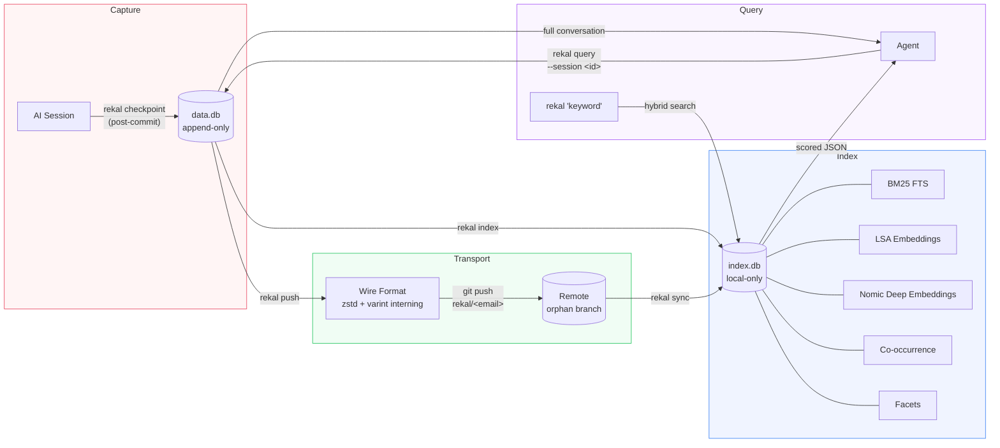

# Rekal

[Website](https://rekal.dev) · [GitHub](https://github.com/rekal-dev/rekal-cli) · [Discord](https://discord.gg/eNNabp4b)

> **Beta** — Works with Claude Code. More agents coming.

## Two problems

### Intent has no ledger

Code has git. Every line, every change, every author — recorded forever.

But the reasoning behind the code has nothing. The conversations where a developer and an AI explored a problem, debated approaches, rejected alternatives, arrived at a decision — those vanish the moment the session ends.

The code says *what*. The intent says *why*. The *why* has no permanent record.

### Agents can't remember

An AI agent starts every session blank. It reads the code. It does not know why the code looks the way it does. It does not know what was tried and rejected last week. It does not know that the team already explored and abandoned the approach it is about to suggest.

Humans have institutional memory. Agents have none.

## What Rekal does

Rekal hooks into git and captures your AI session context at every commit. That context becomes a permanent, immutable, shared part of your project history — distributed through git, not through a separate service. When your agent starts a new session, it recalls the precise prior context for the problem it is working on. It knows why the code looks the way it does.

## What makes Rekal different

Rekal is built on beliefs. Those beliefs guide every decision. When a choice conflicts with a belief, the choice loses. That is the difference.

- **Immutable.** The record cannot be edited or deleted. Append-only is what makes the ledger trustworthy.
- **Intent lives next to the code.** Not in a separate system. Not behind someone else's service. In git, next to the code it explains.
- **Thin on the wire, rich on the machine.** Git is the transport and every byte costs. Indexes, embeddings, search — all computed locally.
- **Secure by design.** The data never leaves git and the local machine. No servers. No APIs. No telemetry.
- **Simple.** Single binary. Everything embedded. Nothing to install, nothing to configure, nothing to break.
- **Transparent.** The user sees everything that was created and can remove all of it. No sticky tape.
- **Agent first.** The agent is the consumer. Output format, query interface, context loading — all favor the agent.

The full version: [SOUL.md](SOUL.md).

## Install and uninstall

Install:

```bash
curl -fsSL https://raw.githubusercontent.com/rekal-dev/rekal-cli/main/scripts/install.sh | bash
```

Default location: `~/.local/bin`. Override with `--target <dir>`.

Uninstall:

```bash
rm ~/.local/bin/rekal
```

If you installed to a custom directory, remove the binary from there instead.

## Quick start

Requirements: Git, macOS or Linux.

### Set up

```bash
cd your-project
rekal init
```

`rekal init` creates the following on your system:

- `.rekal/` directory containing `data.db` (shared truth) and `index.db` (local search index)
- A `post-commit` and `pre-push` git hook (marked `# managed by rekal`)
- A Claude Code skill at `.claude/skills/rekal/SKILL.md`
- An orphan branch `rekal/<your-email>` for transport
- Appends `.rekal/` to your `.gitignore`

### Tear down

```bash
rekal clean
```

`rekal clean` removes everything `init` created:

- Deletes the `.rekal/` directory and all its contents
- Removes the git hooks (only the ones marked `# managed by rekal`)

No residue. If you want to start over, run `clean` then `init`.

### Verify

```bash
rekal version
```

When a newer release is available, the CLI prints an update notice after each command.

## How it works



The flow: commit → capture → push → sync → recall.

### Developer touchpoints

| You do | Rekal does |
|--------|------------|
| `rekal init` (once per repo) | Creates `.rekal/`, installs git hooks, writes agent skill file |
| `git commit` | Hook runs `rekal checkpoint` — snapshots your active AI session into `data.db` (append-only) |
| `git push` | Hook runs `rekal push` — encodes only your unexported data into compact wire format (zstd + string interning) and pushes to your orphan branch `rekal/<email>` |
| `rekal sync` (manual, when you want team context) | Fetches teammates' orphan branches, imports their sessions into your local DB and rebuilds the search index |
| `rekal clean` (if needed) | Removes `.rekal/` and hooks from the repo |

Day-to-day: commit and push as normal. Everything else is automatic.

### Agent touchpoints

| Agent does | Rekal does |
|------------|------------|
| `rekal "auth middleware"` | Runs hybrid search (BM25 + LSA + Nomic), returns scored JSON with `snippet_turn_index` pointing to the best-matching turn |
| `rekal query --session <id> --offset N --limit 5` | Returns a small window of turns around the relevant part of the conversation, with `has_more` for pagination |
| `rekal query --session <id> --role human` | Returns only human turns — cheapest way to understand session intent |
| `rekal query --session <id> --full` | Returns everything: turns, tool calls, files touched — only when the agent needs full detail |
| `rekal --file src/billing/ "discount"` | Scoped search filtered by file path |
| `rekal sync` (optional, at session start) | Pulls team context before the agent starts working |

The agent controls how much context it loads. Search first, drill down progressively, full sessions only when needed.

```bash
# Agent touches src/billing/ — first, recall prior context
rekal --file src/billing/ "discount logic"

# Agent finds a relevant session, drills into the matching turn
rekal query --session 01JNQX... --offset 10 --limit 5

# Agent loads full detail only if needed
rekal query --session 01JNQX... --full
```

### Ad-hoc usage

```bash
# Raw SQL for edge cases
rekal query "SELECT id, user_email, branch FROM sessions ORDER BY captured_at DESC LIMIT 5"

# Rebuild the search index after manual DB changes
rekal index

# View recent checkpoints
rekal log
```

### Two databases

Rekal keeps two local DuckDB databases. The split is deliberate.

- **data.db** — The shared truth. Append-only. Contains sessions, turns, tool calls, checkpoints, files touched. This is what gets encoded and pushed through git. `rekal query` reads from here.

- **index.db** — Local intelligence. Full-text indexes, vector embeddings, file co-occurrence graphs. Never synced. Rebuilt anytime with `rekal index`. This is what powers `rekal "query"` search.

Thin on the wire, rich on the machine.

### Orphan branches

Rekal data lives on git orphan branches named `rekal/<email>`. These branches have no common ancestor with your code branches — they do not appear in your project history, do not affect merges, and do not clutter your working tree. Standard git push and fetch move the data.

## Commands reference

| Command | Description |
|---------|-------------|
| `rekal init` | Initialize Rekal in the current git repository |
| `rekal clean` | Remove Rekal setup from this repository |
| `rekal version` | Print the CLI version |
| `rekal checkpoint` | Capture the current session after a commit |
| `rekal push [--force]` | Push Rekal data to the remote branch |
| `rekal sync [--self]` | Sync team context from remote rekal branches |
| `rekal index` | Rebuild the index DB from the data DB |
| `rekal log [--limit N]` | Show recent checkpoints |
| `rekal [filters...] [query]` | Hybrid search over sessions |
| `rekal query --session <id> [--full]` | Drill into a session |
| `rekal query "<sql>" [--index]` | Run raw SQL against the data or index DB |

Full details: [docs/spec/command/](docs/spec/command/).

## Benchmarks

Measured on two real repositories. All times in seconds, wall clock, macOS/arm64.

### Dataset size

| Metric | 165 sessions | 57 sessions |
|--------|-------------|------------|
| Turns | 14,019 | 3,929 |
| data.db | 13 MB | 7.3 MB |
| index.db | 18 MB | 10 MB |

### Operation timing

| Operation | 165 sessions | 57 sessions |
|-----------|-------------|------------|
| init (cold) | 4.60s | 0.98s |
| checkpoint (cold) | 0.50s | 2.66s |
| checkpoint (incremental) | 0.51s | 0.23s |
| index | 0.85s | 0.61s |
| push | 0.18s | 1.93s |
| sync | 2.06s | 1.78s |
| search "authentication" | 0.15s | 0.13s |
| search "database migration" | 0.17s | 0.14s |
| search "error handling" | 0.16s | 0.13s |
| query | 0.14s | 0.10s |
| log | 0.14s | 0.10s |
| clean | 0.13s | 0.10s |

Search stays under 200ms at 14k turns.

## Development

```bash
git clone https://github.com/rekal-dev/rekal-cli.git rekal-cli
cd rekal-cli
mise install
```

See [docs/DEVELOPMENT.md](docs/DEVELOPMENT.md) for the full development guide.

## Getting help

```bash
rekal --help
rekal <command> --help
```

Issues: [github.com/rekal-dev/rekal-cli/issues](https://github.com/rekal-dev/rekal-cli/issues)

## License

Apache-2.0 — see [LICENSE](LICENSE).
