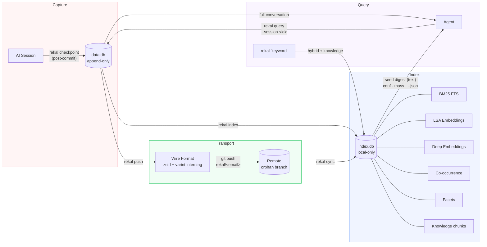
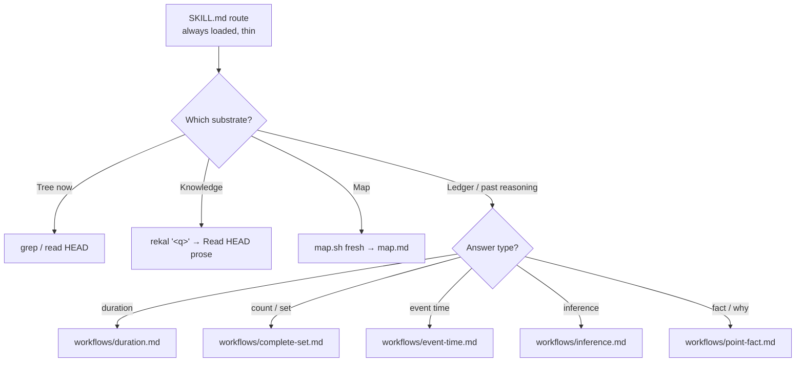

# Rekal

**Your AI agent starts every session blank — no idea why the code looks the way it does, or what your team already tried and threw away. Rekal is the memory it's missing: the *why* behind the code, stored in git, not someone else's cloud.**

[](https://github.com/rekal-dev/rekal-cli/releases)
[](https://github.com/rekal-dev/rekal-cli/actions/workflows/ci.yml)
[](https://arxiv.org/abs/2607.14390)
[](LICENSE)
[](https://discord.gg/eNNabp4b)
[](https://github.com/rekal-dev/rekal-cli/stargazers)

[Website](https://rekal.dev) · [arXiv Paper](https://arxiv.org/abs/2607.14390) · [Discord](https://discord.gg/eNNabp4b)

📄 **Research published:** ["Why Git Is the Memory Solution for the Agentic Development Lifecycle"](https://arxiv.org/abs/2607.14390) on arXiv (2607.14390)

> **Zero preprocessing. Pure query-time intelligence.** Works with Claude Code, Cursor, Copilot, Codex, Gemini, and OpenCode.

<!--
  TODO (highest-leverage single change to this README): drop a demo GIF/asciinema here.
  One loop, ~15s: `git commit` → new session → `rekal "why did we drop batching?"`
  → the agent recalls the abandoned approach and the reason. Until this exists, the
  reader has to *imagine* the product. Record with asciinema/vhs, export to .gif or .svg,
  commit under docs/assets/, and replace this comment with the image.
-->

Every commit captures reasoning. But traditional memory systems trap you: **slow indexing or external servers**. Rekal breaks that. No preprocessing. No memory layers. No external service. Pure query-time inference — everything computed on-demand, locally. Your agent recalls the conversation that produced every change: the reasoning, the dead-ends already ruled out, the exact decision. In ~7.5K context tokens. In a few seconds. From git.

**The three moves:**

- **Commit** → Snapshot the session into an append-only log. No preprocessing. No indexing pipeline. No wait.
- **Push** → Only merged work reaches your team via git orphan branch. No server, no external service, no uploads.
- **Query** → `rekal "<problem>"` runs full inference on-demand: lexical + graph + deep semantics, all local, all at query time. Returns the turn that answers, with confidence and provenance.

## See it in action

Last week, one engineer and their agent settled how webhook retries should work. This week, a *different* agent is about to re-propose the approach that was already rejected — until it asks Rekal first:

```console
$ rekal "should webhook retries use a fixed delay?"
```
```text
INJECT top=0.81 gap=0.28 2 seeds
  01JNQX8F2K9M conf=0.81 t14 [reached 3×· "webhook retry policy"] "no, a fixed 5s delay stampedes the downstream on recovery. Use exponential backoff with jitter…"
  01JNR2A7YQ4P conf=0.53 t9 "we capped retries at 5 attempts then dead-letter — anything past that never lands…"
```

Compact text by default — the whole answer in two lines. Line one is the
**verdict**: `INJECT` (surface this memory now); the alternatives are
`KNOWLEDGE` (read a HEAD-prose pointer instead) and `SILENCE` (memory isn't
the tool — stay quiet). Each seed is a session id, its **absolute**
confidence, the turn to drill (`t14`), and the snippet. `[reached 3×· …]` is
the recall graph: this memory has been used three times before, last for
"webhook retry policy" — a load-bearing decision, and a good first drill.

The agent gets the decision **and the reason the alternative was rejected** — sourced from the human's own mid-course correction — before it wastes a round re-proposing it. It drills in for the full reasoning with one more call:

```console
$ rekal query --session 01JNQX8F2K9M --role human_steering
```

Everything defaults to text an agent can act on directly; add `--json` when a program needs to parse it — the same result carries `score` (rank within the set, max-normalized), absolute `confidence`, and raw BM25 `mass`, so a silence gate can reject a query that is merely the best of a weak set:

```console
$ rekal --json "should webhook retries use a fixed delay?"
```
```json
{
  "query": "should webhook retries use a fixed delay?",
  "results": [
    {
      "session_id": "01JNQX8F2K9M",
      "score": 0.87, "confidence": 0.81, "mass": 5.4,
      "snippet": "no, a fixed 5s delay stampedes the downstream on recovery. Use exponential backoff with jitter…",
      "snippet_role": "human_steering",
      "session": { "author": "dev@team.dev", "branch": "feat/webhooks", "commit": "a1b2c3d" }
    }
  ]
}
```

## Why not just…?

| Instead of | The gap | Rekal |
|---|---|---|
| a `MEMORY.md` / notes file | rots, hand-maintained, tied to one branch | captured automatically at every commit, immutable, branch-aware |
| a RAG / memory SaaS | preprocessing delays + external servers + privacy risk | zero preprocessing, all inference at query time, local-only, no external service |
| editor rules (Cursor/Copilot) | per-user, per-editor, ephemeral, no team history | team-wide persistent memory, travels with repo, shared decision ledger |
| `git log` / `git blame` | tell you *what* changed, never *why* | the conversation and reasoning behind the change |

## What makes Rekal different

Rekal is built on beliefs. Those beliefs guide every decision. When a choice conflicts with a belief, the choice loses. That is the difference.

- **Zero preprocessing.** No indexing pipeline. No embedding queues. Sessions land raw into the store, inference happens at query time only.
- **Pure query-time inference.** Full search stack — lexical + graph + deep retrieval — runs on-demand, locally. No external service, no memory layers.
- **Intent in git.** Not in a separate system. Not behind someone else's service. Orphan branches, full history, travels with the repo.
- **Thin wire, rich machine.** Every byte over git costs. Search, embeddings, inference — all run locally. No servers, no APIs, no telemetry.
- **Single binary.** Everything embedded — database, embeddings, inference engine, compression. Zero setup. Just `rekal init` and commit.
- **Provenance.** Every answer traces back: the turn, the session, the commit it produced, the reasoning it captured. Full graph.
- **Agent-first output.** A compact text digest built for an agent to act on — verdict, per-seed confidence, drill pointers — with structured JSON one `--json` away. Silence gates and confidence thresholds, not prose.

The full version: [SOUL.md](SOUL.md).

## The research

The design is argued and measured in our paper — *"Why Git Is the Memory
Solution for the Agentic Development Lifecycle"* ([arXiv:2607.14390](https://arxiv.org/abs/2607.14390), 
[PDF](https://arxiv.org/pdf/2607.14390)): memory bound to git inherits
its hard guarantees instead of rebuilding them; retrieval is closed as a
seed-supply problem (honest grep floors, a mechanism study, the facet term);
and a gated router answers each question kind — structure, episode, or
rationale — at a few hundred tokens per question. The benchmark labels
itself from your own commit–session links, so every result is replicable on
your own history at zero annotation cost. See [docs/research/](docs/research/) for details.

### Measured performance

On two public long-term-memory benchmarks, Rekal reaches strong answer
quality with **no preprocessing, no memory layers, and no external inference
service** — every number below is pure query-time inference over git,
computed locally. The answering agent is **GPT-5 Sol**; Rekal supplies the
memory, the model supplies the answer:

| Benchmark | Accuracy | Recall@20 | Context tokens/query | Agent turns/query | Time/query |
|---|---|---|---|---|---|
| LoCoMo | 90.57% | 98.61% | ~7.5K | 5.9 | a few seconds |
| LongMemEval | 86.60% | — | ~10.5K | 6.6 | a few seconds |

| Additional metric (LoCoMo) | Result |
|---|---|
| Recall@10 | 93.60% |
| Recall@5 | 86.44% |
| Strict accuracy | 70.39% |
| Official F1 | 63.0 |
| Typical answer output | ~78–80 tokens |
| L1 / L2 memory layers | None |
| External memory service | None |
| Workflow adoption | 100% |

That is 90.6% LoCoMo accuracy, 86.6% LongMemEval accuracy, and 98.6% Top-20
recall — at roughly six agent turns per question, with no preprocessing and
no memory tier behind it.

**The trade-off, made on purpose.** Everything is computed at query time.
There is no index to precompute, no embedding queue to drain, no memory
service to call — so a query runs the full stack live and costs a few
seconds. In exchange: nothing to wait on after a commit, no infrastructure
to run, and data that never leaves the machine. Rekal spends query-time
latency to buy zero preprocessing and zero external dependencies. For a
memory an agent consults a handful of times per task, that is the right side
of the trade.

Token estimates are the visible context produced during the enhanced
hard-question runs. Reproduce them on your own history: the benchmark labels
itself from your commit–session links at zero annotation cost (see
[docs/research/](docs/research/)).

## Install and uninstall

Install:

```bash
curl -fsSL https://raw.githubusercontent.com/rekal-dev/rekal-cli/main/scripts/install.sh | bash
```

Default location: `~/.local/bin`. Override with `--target <dir>`.

Uninstall:

```bash
rm ~/.local/bin/rekal
```

If you installed to a custom directory, remove the binary from there instead.

## Quick start

Requirements: Git, macOS or Linux.

### Set up

```bash
cd your-project
rekal init
```

`rekal init` creates the following on your system:

- `.rekal/` directory containing `data.db` (shared truth) and `index.db` (local search index)
- A `post-commit` and `pre-push` git hook (marked `# managed by rekal`)
- The Claude Code skill under `.claude/skills/rekal/` (see [Agent skill](#agent-skill))
- One marker-tagged sentence in `CLAUDE.md` pointing agents at the skill (created if missing; your own content is never touched)
- An orphan branch `rekal/<your-email>` for transport
- Appends `.rekal/` to your `.gitignore`

That one sentence is the whole developer experience for most users: init,
then commit and push as normal — your agent routes its own memory from there.

Running `rekal init` again in an already-initialized repo does **not** rebuild
your store. It refreshes the version-managed skill and hooks and leaves your
data untouched — so after you upgrade the binary, `rekal init` is how skill
updates reach an existing repo. A full reinitialize still requires
`rekal clean` first.

### Tear down

```bash
rekal clean
```

`rekal clean` removes everything `init` created:

- Deletes the `.rekal/` directory and all its contents
- Removes the git hooks (only the ones marked `# managed by rekal`)
- Removes the installed skill (`.claude/skills/rekal/` plus any legacy
  `rekal-*` companion dirs), pruning `.claude/skills/` and `.claude/` only
  if they are left empty — your own `.claude` content is never touched
- Removes the marker-tagged `CLAUDE.md` sentence (deleting the file only if
  nothing else remains)

No residue. If you want to start over, run `clean` then `init`.

### Verify

```bash
rekal version
```

When a newer release is available, the CLI prints an update notice after each command.

## How it works


```mermaid
flowchart LR
    subgraph capture ["Capture"]
        A["AI Session"] -->|"rekal checkpoint<br/>(post-commit)"| B[("data.db<br/>append-only")]
    end

    subgraph transport ["Transport"]
        B -->|"rekal push"| C["Wire Format<br/>zstd + varint interning"]
        C -->|"git push<br/>rekal/&lt;email&gt;"| D[("Remote<br/>orphan branch")]
    end

    subgraph index ["Index"]
        B -->|"rekal index"| E[("index.db<br/>local-only")]
        D -->|"rekal sync"| E
        E --- F["BM25 FTS"]
        E --- G["LSA Embeddings"]
        E --- N["Deep Embeddings"]
        E --- H["Co-occurrence"]
        E --- I["Facets"]
        E --- KN["Knowledge chunks"]
    end

    subgraph query ["Query"]
        J["rekal 'keyword'"] -->|"hybrid + knowledge"| E
        E -->|"seed digest (text)<br/>conf · mass · --json"| K["Agent"]
        K -->|"rekal query<br/>--session &lt;id&gt;"| B
        B -->|"full conversation"| K
    end

    style capture fill:#fff5f5,stroke:#e94560,color:#333
    style transport fill:#f0fdf4,stroke:#22c55e,color:#333
    style index fill:#f0f4ff,stroke:#3b82f6,color:#333
    style query fill:#faf5ff,stroke:#a855f7,color:#333
```

The flow: commit → capture → push → sync → recall.

### Developer touchpoints

| You do | Rekal does |
|--------|------------|
| `rekal init` (once per repo) | Creates `.rekal/`, installs git hooks, writes the agent skill (tip + scripts + references) |
| `git commit` | Hook runs `rekal checkpoint` — snapshots your active AI session into `data.db` (append-only) |
| `git push` | Hook runs `rekal push` — encodes only your unexported data into compact wire format (zstd + string interning) and pushes to your orphan branch `rekal/<email>` |
| `rekal sync` (manual, when you want team context) | Fetches teammates' orphan branches, imports their sessions into your local DB and rebuilds the search index |
| `rekal clean` (if needed) | Removes `.rekal/` and hooks from the repo |

Day-to-day: commit and push as normal. Everything else is automatic.

### What your agent does

Your agent recalls with `rekal "<query>"` — the compact seed digest it acts on
directly — and drills into any session with `rekal query --session <id>`,
controlling how much context it loads: search first, drill progressively, full
sessions only when needed. The complete command surface and the
progressive-loading pattern are in **[docs/usage.md](docs/usage.md)**.

### The agent skill

`rekal init` installs one Claude Code skill under `.claude/skills/rekal/`. It is
a thin route: the agent classifies each question and sends it to one substrate —
**tree** (grep, now), **knowledge** (prose at HEAD), **ledger** (past
reasoning), or **map** (structure). For a ledger question, a second step
classifies the *answer type* and loads exactly one specialist workflow, so
"how long", "how many", and "when" each get concentrated, non-overlapping
guidance. Retrieval and navigation are commands in the binary; the skill is
judgment, not scripts.


```mermaid
flowchart TB
    tip["SKILL.md route<br/>always loaded, thin"]
    tip --> triage{"Which substrate?"}
    triage -->|Tree now| grep["grep / read HEAD"]
    triage -->|Knowledge| readk["rekal '&lt;q&gt;' → Read HEAD prose"]
    triage -->|Map| mapf["map.sh fresh → map.md"]
    triage -->|Ledger / past reasoning| gate{"Answer type?"}
    gate -->|duration| w1["workflows/duration.md"]
    gate -->|count / set| w2["workflows/complete-set.md"]
    gate -->|event time| w3["workflows/event-time.md"]
    gate -->|inference| w4["workflows/inference.md"]
    gate -->|fact / why| w5["workflows/point-fact.md"]
```

Full skill reference: **[docs/usage.md#the-agent-skill](docs/usage.md#the-agent-skill)** ·
design: [docs/design/skill-router.md](docs/design/skill-router.md).

### Under the hood

Two local DuckDB databases — `data.db` (append-only truth, the only thing
pushed) and `index.db` (rebuildable local intelligence) — with git orphan
branches for transport, **merged-work-only** sharing, worktree-shared stores,
and optional cross-repo recall. All of it is covered in
**[docs/usage.md](docs/usage.md)**.

## Configuration

Rekal is zero-config by default. To tune ranking weights or point deep
embeddings at an OpenAI-compatible endpoint (vLLM, Ollama, LM Studio, TEI),
there is exactly one file — `.rekal/config.json`, gitignored and local-only,
never committed. See **[docs/configuration.md](docs/configuration.md)**.

## Commands reference

| Command | Description |
|---------|-------------|
| `rekal init` | Initialize Rekal in the current git repository |
| `rekal clean` | Remove Rekal setup from this repository |
| `rekal version` | Print the CLI version |
| `rekal checkpoint` | Capture the current session after a commit |
| `rekal push [--force] [--re-export]` | Push Rekal data to the remote branch (merged work only) |
| `rekal sync [--self]` | Sync team context from remote rekal branches |
| `rekal index [--include-all\|--include <repo>\|--no-local]` | Rebuild the index DB; optionally fold in cross-repo local sessions |
| `rekal log [--limit N]` | Show recent checkpoints |
| `rekal [--file <re>] [--commit <sha>] [--author <email>] [--actor human\|agent] [-n N] [--explain] [query]` | Hybrid search over sessions, optionally scoped by file, commit, author, or actor; `--explain` adds per-layer scores and related-session joins |
| `rekal query --session <id> [--role <r>] [--offset N] [--limit N] [--full]` | Drill into a session — window by turn, filter by role (`human`/`assistant`/`human_steering`/`summary`), or load full detail |
| `rekal query "<sql>" [--index]` | Run raw SQL against the data or index DB |

Full details: [docs/spec/command/](docs/spec/command/).

## Documentation

| Guide | What's in it |
|---|---|
| [docs/usage.md](docs/usage.md) | The two databases, orphan branches & merged-work-only sharing, worktrees, the full agent command surface, the skill, cross-repo recall |
| [docs/configuration.md](docs/configuration.md) | `.rekal/config.json` — ranking weights, embedding backends, API-key handling |
| [docs/spec/command/](docs/spec/command/) | Per-command reference specs |
| [docs/research/](docs/research/) | The paper, benchmark harness, and evaluation strategy |
| [docs/DEVELOPMENT.md](docs/DEVELOPMENT.md) | Building, testing, and contributing |
| [SOUL.md](SOUL.md) | The beliefs behind every design decision |

## Development

```bash
git clone https://github.com/rekal-dev/rekal-cli.git rekal-cli
cd rekal-cli
mise install
```

See [docs/DEVELOPMENT.md](docs/DEVELOPMENT.md) for the full development guide.

## Getting help

```bash
rekal --help
rekal <command> --help
```

Issues: [github.com/rekal-dev/rekal-cli/issues](https://github.com/rekal-dev/rekal-cli/issues)

## Citation

If you use Rekal or build on the research, please cite the paper:

```bibtex
@misc{guo2026rekal,
  title         = {Why Git Is the Memory Solution for the Agentic Development Lifecycle},
  author        = {Guo, Frank},
  year          = {2026},
  eprint        = {2607.14390},
  archivePrefix = {arXiv},
  primaryClass  = {cs.SE},
  url           = {https://arxiv.org/abs/2607.14390}
}
```

## License

Apache-2.0 — see [LICENSE](LICENSE).
