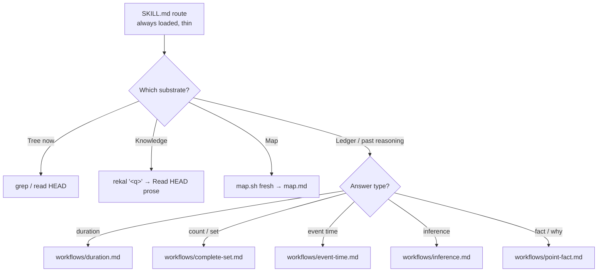
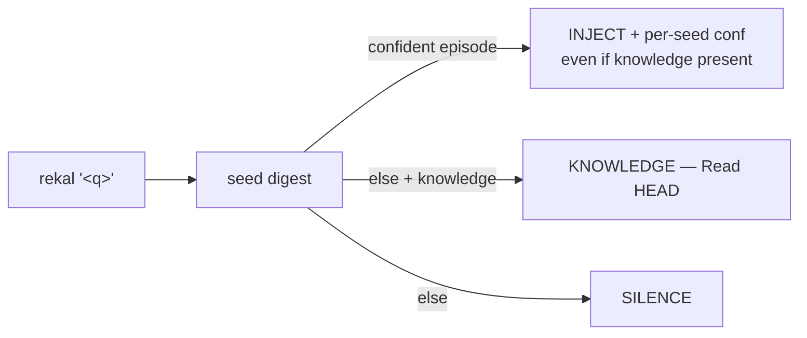

# Rekal

**Your AI agent starts every session blank — no idea why the code looks the way it does, or what your team already tried and threw away. Rekal is the memory it's missing: the *why* behind the code, stored in git, not someone else's cloud.**

[](https://github.com/rekal-dev/rekal-cli/releases)
[](https://github.com/rekal-dev/rekal-cli/actions/workflows/ci.yml)
[](https://arxiv.org/abs/2607.14390)
[](LICENSE)
[](https://discord.gg/eNNabp4b)
[](https://github.com/rekal-dev/rekal-cli/stargazers)

[Website](https://rekal.dev) · [arXiv Paper](https://arxiv.org/abs/2607.14390) · [Discord](https://discord.gg/eNNabp4b)

📄 **Research published:** ["Why Git Is the Memory Solution for the Agentic Development Lifecycle"](https://arxiv.org/abs/2607.14390) on arXiv (2607.14390)

> **Zero preprocessing. Pure query-time intelligence.** Works with Claude Code, Cursor, Copilot, Codex, Gemini, and OpenCode.

<!--
  TODO (highest-leverage single change to this README): drop a demo GIF/asciinema here.
  One loop, ~15s: `git commit` → new session → `rekal "why did we drop batching?"`
  → the agent recalls the abandoned approach and the reason. Until this exists, the
  reader has to *imagine* the product. Record with asciinema/vhs, export to .gif or .svg,
  commit under docs/assets/, and replace this comment with the image.
-->

Every commit captures reasoning. But traditional memory systems trap you: **slow indexing or external servers**. Rekal breaks that. No preprocessing. No memory layers. No external service. Pure query-time inference — everything computed on-demand, locally. Your agent recalls the conversation that produced every change: the reasoning, the dead-ends already ruled out, the exact decision. In ~7.5K context tokens. In a few seconds. From git.

**The three moves:**

- **Commit** → Snapshot the session into an append-only log. No preprocessing. No indexing pipeline. No wait.
- **Push** → Only merged work reaches your team via git orphan branch. No server, no external service, no uploads.
- **Query** → `rekal "<problem>"` runs full inference on-demand: lexical + graph + deep semantics, all local, all at query time. Returns the turn that answers, with confidence and provenance.

## See it in action

Last week, one engineer and their agent settled how webhook retries should work. This week, a *different* agent is about to re-propose the approach that was already rejected — until it asks Rekal first:

```console
$ rekal "should webhook retries use a fixed delay?"
```
```json
{
  "query": "should webhook retries use a fixed delay?",
  "total": 3,
  "results": [
    {
      "session_id": "01JNQX8F2K9M...",
      "score": 0.87,
      "confidence": 0.81,
      "mass": 5.4,
      "snippet": "...no, a fixed 5s delay stampedes the downstream on
                  recovery. Use exponential backoff with jitter instead.",
      "snippet_role": "human_steering",
      "session": {
        "author": "dev@team.dev",
        "branch": "feat/webhooks",
        "commit": "a1b2c3d",
        "files": ["services/webhooks/delivery.go"]
      }
    }
  ]
}
```

`score` ranks within the result set (max-normalized). The skill silence gate
uses absolute `confidence` (and raw BM25 `mass`) so junk queries do not
clear the bar just by being the best of a weak set.
The agent gets the decision **and the reason the alternative was rejected** — sourced from the human's own mid-course correction — before it wastes a round re-proposing it. That is the whole product in one exchange. It drills in for the full reasoning with one more call:

```console
$ rekal query --session 01JNQX8F2K9M... --role human_steering
```

## Why not just…?

| Instead of | The gap | Rekal |
|---|---|---|
| a `MEMORY.md` / notes file | rots, hand-maintained, tied to one branch | captured automatically at every commit, immutable, branch-aware |
| a RAG / memory SaaS | preprocessing delays + external servers + privacy risk | zero preprocessing, all inference at query time, local-only, no external service |
| editor rules (Cursor/Copilot) | per-user, per-editor, ephemeral, no team history | team-wide persistent memory, travels with repo, shared decision ledger |
| `git log` / `git blame` | tell you *what* changed, never *why* | the conversation and reasoning behind the change |

## What makes Rekal different

Rekal is built on beliefs. Those beliefs guide every decision. When a choice conflicts with a belief, the choice loses. That is the difference.

- **Zero preprocessing.** No indexing pipeline. No embedding queues. Sessions land raw into the store, inference happens at query time only.
- **Pure query-time inference.** Full search stack — lexical + graph + deep retrieval — runs on-demand, locally. No external service, no memory layers.
- **Intent in git.** Not in a separate system. Not behind someone else's service. Orphan branches, full history, travels with the repo.
- **Thin wire, rich machine.** Every byte over git costs. Search, embeddings, inference — all run locally. No servers, no APIs, no telemetry.
- **Single binary.** Everything embedded — database, embeddings, inference engine, compression. Zero setup. Just `rekal init` and commit.
- **Provenance.** Every answer traces back: the turn, the session, the commit it produced, the reasoning it captured. Full graph.
- **Agent-first output.** Scored JSON, drill-down interface, silence gates, confidence thresholds. Designed for agent consumption, not readability.

The full version: [SOUL.md](SOUL.md).

## The research

The design is argued and measured in our paper — *"Why Git Is the Memory
Solution for the Agentic Development Lifecycle"* ([arXiv:2607.14390](https://arxiv.org/abs/2607.14390), 
[PDF](https://arxiv.org/pdf/2607.14390)): memory bound to git inherits
its hard guarantees instead of rebuilding them; retrieval is closed as a
seed-supply problem (honest grep floors, a mechanism study, the facet term);
and a gated router answers each question kind — structure, episode, or
rationale — at a few hundred tokens per question. The benchmark labels
itself from your own commit–session links, so every result is replicable on
your own history at zero annotation cost. See [docs/research/](docs/research/) for details.

### Measured performance

On two public long-term-memory benchmarks, Rekal reaches strong answer
quality with **no preprocessing, no memory layers, and no external inference
service** — every number below is pure query-time inference over git,
computed locally. The answering agent is **GPT-5 Sol**; Rekal supplies the
memory, the model supplies the answer:

| Benchmark | Accuracy | Recall@20 | Context tokens/query | Agent turns/query | Time/query |
|---|---|---|---|---|---|
| LoCoMo | 90.57% | 98.61% | ~7.5K | 5.9 | a few seconds |
| LongMemEval | 86.60% | — | ~10.5K | 6.6 | a few seconds |

| Additional metric (LoCoMo) | Result |
|---|---|
| Recall@10 | 93.60% |
| Recall@5 | 86.44% |
| Strict accuracy | 70.39% |
| Official F1 | 63.0 |
| Typical answer output | ~78–80 tokens |
| L1 / L2 memory layers | None |
| External memory service | None |
| Workflow adoption | 100% |

That is 90.6% LoCoMo accuracy, 86.6% LongMemEval accuracy, and 98.6% Top-20
recall — at roughly six agent turns per question, with no preprocessing and
no memory tier behind it.

**The trade-off, made on purpose.** Everything is computed at query time.
There is no index to precompute, no embedding queue to drain, no memory
service to call — so a query runs the full stack live and costs a few
seconds. In exchange: nothing to wait on after a commit, no infrastructure
to run, and data that never leaves the machine. Rekal spends query-time
latency to buy zero preprocessing and zero external dependencies. For a
memory an agent consults a handful of times per task, that is the right side
of the trade.

Token estimates are the visible context produced during the enhanced
hard-question runs. Reproduce them on your own history: the benchmark labels
itself from your commit–session links at zero annotation cost (see
[docs/research/](docs/research/)).

## Install and uninstall

Install:

```bash
curl -fsSL https://raw.githubusercontent.com/rekal-dev/rekal-cli/main/scripts/install.sh | bash
```

Default location: `~/.local/bin`. Override with `--target <dir>`.

Uninstall:

```bash
rm ~/.local/bin/rekal
```

If you installed to a custom directory, remove the binary from there instead.

## Quick start

Requirements: Git, macOS or Linux.

### Set up

```bash
cd your-project
rekal init
```

`rekal init` creates the following on your system:

- `.rekal/` directory containing `data.db` (shared truth) and `index.db` (local search index)
- A `post-commit` and `pre-push` git hook (marked `# managed by rekal`)
- The Claude Code skill under `.claude/skills/rekal/` (see [Agent skill](#agent-skill))
- One marker-tagged sentence in `CLAUDE.md` pointing agents at the skill (created if missing; your own content is never touched)
- An orphan branch `rekal/<your-email>` for transport
- Appends `.rekal/` to your `.gitignore`

That one sentence is the whole developer experience for most users: init,
then commit and push as normal — your agent routes its own memory from there.

Running `rekal init` again in an already-initialized repo does **not** rebuild
your store. It refreshes the version-managed skill and hooks and leaves your
data untouched — so after you upgrade the binary, `rekal init` is how skill
updates reach an existing repo. A full reinitialize still requires
`rekal clean` first.

### Tear down

```bash
rekal clean
```

`rekal clean` removes everything `init` created:

- Deletes the `.rekal/` directory and all its contents
- Removes the git hooks (only the ones marked `# managed by rekal`)
- Removes the installed skill (`.claude/skills/rekal/` plus any legacy
  `rekal-*` companion dirs), pruning `.claude/skills/` and `.claude/` only
  if they are left empty — your own `.claude` content is never touched
- Removes the marker-tagged `CLAUDE.md` sentence (deleting the file only if
  nothing else remains)

No residue. If you want to start over, run `clean` then `init`.

### Verify

```bash
rekal version
```

When a newer release is available, the CLI prints an update notice after each command.

## How it works


```mermaid
flowchart LR
    subgraph capture ["Capture"]
        A["AI Session"] -->|"rekal checkpoint<br/>(post-commit)"| B[("data.db<br/>append-only")]
    end

    subgraph transport ["Transport"]
        B -->|"rekal push"| C["Wire Format<br/>zstd + varint interning"]
        C -->|"git push<br/>rekal/&lt;email&gt;"| D[("Remote<br/>orphan branch")]
    end

    subgraph index ["Index"]
        B -->|"rekal index"| E[("index.db<br/>local-only")]
        D -->|"rekal sync"| E
        E --- F["BM25 FTS"]
        E --- G["LSA Embeddings"]
        E --- N["Deep Embeddings"]
        E --- H["Co-occurrence"]
        E --- I["Facets"]
        E --- KN["Knowledge chunks"]
    end

    subgraph query ["Query"]
        J["rekal 'keyword'"] -->|"hybrid + knowledge"| E
        E -->|"scored JSON<br/>confidence · mass"| K["Agent"]
        K -->|"rekal query<br/>--session &lt;id&gt;"| B
        B -->|"full conversation"| K
    end

    style capture fill:#fff5f5,stroke:#e94560,color:#333
    style transport fill:#f0fdf4,stroke:#22c55e,color:#333
    style index fill:#f0f4ff,stroke:#3b82f6,color:#333
    style query fill:#faf5ff,stroke:#a855f7,color:#333
```

The flow: commit → capture → push → sync → recall.

### Developer touchpoints

| You do | Rekal does |
|--------|------------|
| `rekal init` (once per repo) | Creates `.rekal/`, installs git hooks, writes the agent skill (tip + scripts + references) |
| `git commit` | Hook runs `rekal checkpoint` — snapshots your active AI session into `data.db` (append-only) |
| `git push` | Hook runs `rekal push` — encodes only your unexported data into compact wire format (zstd + string interning) and pushes to your orphan branch `rekal/<email>` |
| `rekal sync` (manual, when you want team context) | Fetches teammates' orphan branches, imports their sessions into your local DB and rebuilds the search index |
| `rekal clean` (if needed) | Removes `.rekal/` and hooks from the repo |

Day-to-day: commit and push as normal. Everything else is automatic.

### Agent touchpoints

| Agent does | Rekal does |
|------------|------------|
| `rekal "auth middleware"` | Hybrid search (BM25 + LSA + deep embed + facets) plus a separate `knowledge` block for prose at HEAD; returns scored JSON with `confidence` / `mass` for silence gates and `snippet_turn_index` for drill |
| `rekal query --session <id> --offset N --limit 5` | Returns a small window of turns around the relevant part of the conversation, with `has_more` for pagination |
| `rekal query --session <id> --role human` | Returns only human turns — cheapest way to understand session intent |
| `rekal query --session <id> --full` | Returns everything: turns, tool calls, files touched — only when the agent needs full detail |
| `rekal --file src/billing/ "discount"` | Scoped search filtered by file path |
| `rekal --commit <sha>` | Finds the session(s) that produced a commit — the anchor for change provenance |
| `rekal query --session <id> --role human_steering` | Returns only the mid-course corrections — the highest-signal turns for intent and preferences |
| `rekal query --session <id> --role summary` | Returns the harness-written compaction distillations — the cheapest overview of a long session |
| `rekal sync` (optional, at session start) | Pulls team context before the agent starts working |

The agent controls how much context it loads. Search first, drill down progressively, full sessions only when needed.

```bash
# Agent touches src/billing/ — first, recall prior context
rekal --file src/billing/ "discount logic"

# Agent finds a relevant session, drills into the matching turn
rekal query --session 01JNQX... --offset 10 --limit 5

# Agent loads full detail only if needed
rekal query --session 01JNQX... --full
```

### Agent skill

The raw commands above are the interface; the **skill** is the playbook.
`rekal init` installs one Claude Code skill under `.claude/skills/rekal/` —
a thin route (substrate triage + silence + dispatch) plus on-demand
`references/` and a couple of built-in gate `scripts/` (progressive
disclosure). Retrieval and navigation are commands in the binary, not
scripts. The agent never picks among skills; it classifies the question,
routes to one substrate, and loads only the module it needs. For a question
that belongs to the past-reasoning **ledger**, a second step classifies the
*answer type* and loads exactly one specialist workflow — so a "how long", a
"how many", and a "when" each get concentrated, non-overlapping guidance.
Design detail: [`docs/design/skill-router.md`](docs/design/skill-router.md).


```mermaid
flowchart TB
    tip["SKILL.md route<br/>always loaded, thin"]
    tip --> triage{"Which substrate?"}
    triage -->|Tree now| grep["grep / read HEAD"]
    triage -->|Knowledge| readk["rekal '&lt;q&gt;' → Read HEAD prose"]
    triage -->|Map| mapf["map.sh fresh → map.md"]
    triage -->|Ledger / past reasoning| gate{"Answer type?"}
    gate -->|duration| w1["workflows/duration.md"]
    gate -->|count / set| w2["workflows/complete-set.md"]
    gate -->|event time| w3["workflows/event-time.md"]
    gate -->|inference| w4["workflows/inference.md"]
    gate -->|fact / why| w5["workflows/point-fact.md"]
```

| Home | What |
|-------|------|
| **Route** (`SKILL.md`) | Thin. Decide substrate: **tree** (grep, now) / **knowledge** (prose at HEAD) / **ledger** (past) / **map**. For a ledger question, classify the answer type and route to exactly one workflow. Trusts reasoning; silence when memory is the wrong tool. |
| **Commands** (in the binary) | `rekal "<q>"` (seed digest: INJECT/KNOWLEDGE/SILENCE + per-seed confidence), `rekal find` (complete-set sweep), `rekal query --session`/`--sql` (drill / analytical). Compact text by default, `--json` for machines. |
| **Knowledge** (`references/`) | Rich, on demand: `ledger.md` (reasoning over the past — recall, widen, time-axis, enumeration, why-arcs, provenance, analytical SQL) · `references/workflows/` (five answer-type specialists: duration, complete-set, event-time, inference, point-fact) · map · wiki · flags/SQL. `Read` one and stop. |
| **Gates** (`scripts/`) | The two workflow gates that remain scripts: `map.sh` (fresh/watermark), `wiki-gate.sh`. |


```mermaid
flowchart LR
    j["rekal '&lt;q&gt;'"] --> dg["seed digest"]
    dg -->|confident episode| i["INJECT + per-seed conf<br/>even if knowledge present"]
    dg -->|else + knowledge| k["KNOWLEDGE — Read HEAD"]
    dg -->|else| s["SILENCE"]
```

Skills are versioned with the binary. After you upgrade, run `rekal init` once
to refresh them (it leaves your data untouched; legacy `rekal-*` dirs are removed).

### Ad-hoc usage

```bash
# Raw SQL for edge cases
rekal query "SELECT id, user_email, branch FROM sessions ORDER BY captured_at DESC LIMIT 5"

# Rebuild the search index after manual DB changes
rekal index

# View recent checkpoints
rekal log
```

### Two databases

Rekal keeps two local DuckDB databases. The split is deliberate.

- **data.db** — The shared truth. Append-only. Contains sessions, turns, tool calls, checkpoints, files touched — every branch, merged or not. This is the only source `rekal push` encodes from (filtered to merged work — see below). `rekal query` reads from here.

- **index.db** — Local intelligence. Full-text indexes, vector embeddings, file co-occurrence graphs. Never synced. Rebuilt anytime with `rekal index`. This is what powers `rekal "query"` search.

Thin on the wire, rich on the machine.

### Worktrees

Linked git worktrees (`git worktree add`) share **one** `.rekal/` store — the
one in the main checkout. Init once in the main repo; every worktree then reads
and writes the same data, index, and config, so there's no per-worktree
`rekal sync` or reindex. Checkpoints still record the branch and commit of
whichever worktree you committed in. A repo that never uses worktrees is
unaffected — the store is just its own `.rekal/`.

### Orphan branches

Rekal data lives on git orphan branches named `rekal/<email>`. These branches have no common ancestor with your code branches — they do not appear in your project history, do not affect merges, and do not clutter your working tree. Standard git push and fetch move the data.

### What gets shared: merged work only

Your local databases keep **every** branch — full fidelity, nothing gated. The wire is different: `rekal push` shares a session only when its code **landed on the default branch**, detected two ways, both exact:

- its commit is an ancestor of `main` (merge-commit and rebase workflows), or
- its branch's changes landed as a **squash merge** (patch-equivalence detection — no heuristics)

Unmerged work simply waits: it stays local, is re-checked on every push, and ships automatically the moment its branch merges. Abandoned branches never qualify, so a dead-end spike never reaches your teammates. Commit everything for yourself; share only what merged.

### Cross-repo recall (optional)

Your agent's memory can span your whole machine, not just this repo:

```bash
rekal index --include-all            # recall every local Claude Code session (all repos + shell)
rekal index --include /path/to/repo  # just that repo
rekal index --no-local               # back to this repo only
```

Imported sessions live in the **index only** — never in `data.db`, which is the only thing `push` reads — so they are structurally impossible to share. Results are labeled with their origin (`repo:/path`, `shell:/path`). The setting persists across rebuilds.

## Configuration (optional)

Rekal is zero-config by default. When you do want to tune it, there is exactly one file: `.rekal/config.json` — gitignored, local to the machine, never committed.

```json
{
  "local_import": { "all": true },
  "weights": {
    "bm25": 0.35,
    "lsa": 0.10,
    "nomic": 0.55,
    "steering_boost": 1.3,
    "subagent_downweight": 0.7,
    "facet_boost": 0.3
  },
  "embedding": {
    "endpoint": "$EMBED_ENDPOINT",
    "model": "nomic-embed-text-v1.5",
    "api_key_env": "EMBED_API_KEY",
    "timeout_seconds": 10
  }
}
```

- **`weights`** tunes recall ranking (layer mix, steering-turn boost, subagent discount, and `facet_boost` — the facet layer over each session's tool paths/commands/steering text, on by default at 0.3; set 0 to disable). Applied at query time — changing them takes effect on the next search, no reindex, any corpus size.
- **`embedding`** switches deep semantic embeddings from the embedded nomic model to any OpenAI-compatible endpoint (vLLM, Ollama, LM Studio, TEI). Requests are batched and hard-timeboxed so a slow server can never stall a commit (embedding is always non-fatal). Pointed at localhost, your data still never leaves the machine; pointed at a cloud API, session text leaves — your call, made explicitly.

### API key: three ways, pick one

| Form | Example | Where the secret lives |
|---|---|---|
| Real string | `"api_key": "sk-abc123"` | In the file (gitignored, this machine only) |
| Env reference | `"api_key": "$MY_KEY"` | In the environment, expanded at run time |
| Env var name | `"api_key_env": "EMBED_API_KEY"` | In the environment, read directly |

Precedence: `api_key_env` wins when set and the variable is non-empty; otherwise `api_key` (after `$VAR` expansion) is used; no key at all just omits the `Authorization` header — the normal case for a localhost server. `endpoint` expands `$VAR` the same way. One edge: a *hardcoded* `api_key` containing a literal `$` would be treated as an env reference — real provider keys never contain `$`, and `api_key_env` is the unambiguous form for anything sensitive.
- Switching embedding model/endpoint requires one `rekal index` to regenerate vectors. A content-hash-keyed cache (`.rekal/embed-cache.db`, vectors only, never text) makes routine rebuilds embed only new sessions — and makes a model switch cost exactly one full pass.

## Commands reference

| Command | Description |
|---------|-------------|
| `rekal init` | Initialize Rekal in the current git repository |
| `rekal clean` | Remove Rekal setup from this repository |
| `rekal version` | Print the CLI version |
| `rekal checkpoint` | Capture the current session after a commit |
| `rekal push [--force] [--re-export]` | Push Rekal data to the remote branch (merged work only) |
| `rekal sync [--self]` | Sync team context from remote rekal branches |
| `rekal index [--include-all\|--include <repo>\|--no-local]` | Rebuild the index DB; optionally fold in cross-repo local sessions |
| `rekal log [--limit N]` | Show recent checkpoints |
| `rekal [--file <re>] [--commit <sha>] [--author <email>] [--actor human\|agent] [-n N] [--explain] [query]` | Hybrid search over sessions, optionally scoped by file, commit, author, or actor; `--explain` adds per-layer scores and related-session joins |
| `rekal query --session <id> [--role <r>] [--offset N] [--limit N] [--full]` | Drill into a session — window by turn, filter by role (`human`/`assistant`/`human_steering`/`summary`), or load full detail |
| `rekal query "<sql>" [--index]` | Run raw SQL against the data or index DB |

Full details: [docs/spec/command/](docs/spec/command/).

## Development

```bash
git clone https://github.com/rekal-dev/rekal-cli.git rekal-cli
cd rekal-cli
mise install
```

See [docs/DEVELOPMENT.md](docs/DEVELOPMENT.md) for the full development guide.

## Getting help

```bash
rekal --help
rekal <command> --help
```

Issues: [github.com/rekal-dev/rekal-cli/issues](https://github.com/rekal-dev/rekal-cli/issues)

## Citation

If you use Rekal or build on the research, please cite the paper:

```bibtex
@misc{guo2026rekal,
  title         = {Why Git Is the Memory Solution for the Agentic Development Lifecycle},
  author        = {Guo, Frank},
  year          = {2026},
  eprint        = {2607.14390},
  archivePrefix = {arXiv},
  primaryClass  = {cs.SE},
  url           = {https://arxiv.org/abs/2607.14390}
}
```

## License

Apache-2.0 — see [LICENSE](LICENSE).
