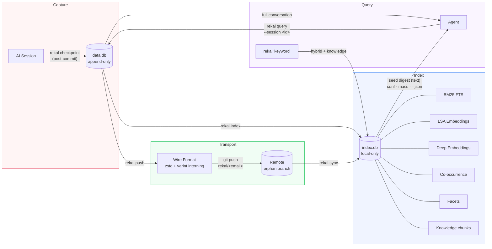
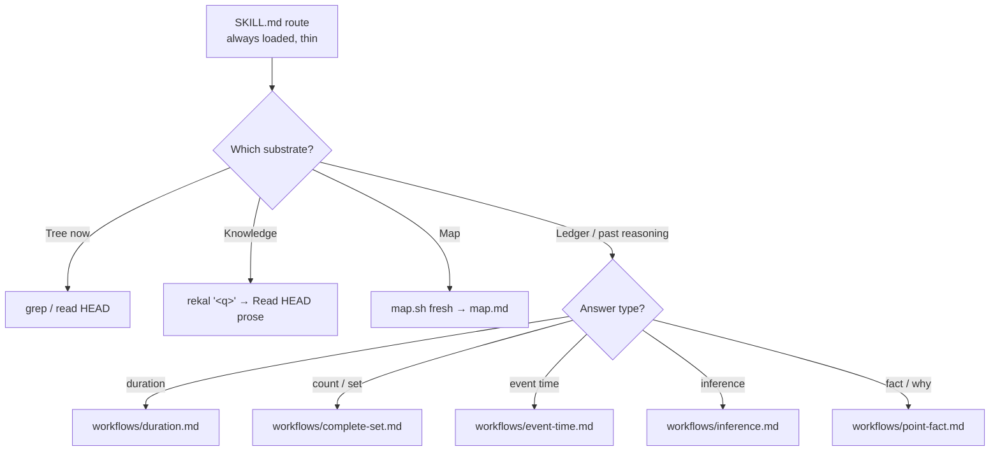

# Rekal

**Rekal is the memory your team is missing — the *why* behind your code, captured at every commit and shared in git, not someone else's cloud. Your AI agent starts every session blank; Rekal gives it your team's reasoning, dead-ends and all.**

[](https://github.com/rekal-dev/rekal-cli/releases)
[](https://github.com/rekal-dev/rekal-cli/actions/workflows/ci.yml)
[](https://arxiv.org/abs/2607.14390)
[](LICENSE)
[](https://discord.gg/eNNabp4b)
[](https://github.com/rekal-dev/rekal-cli/stargazers)

[Quick start](#quick-start) · [How it works](#how-it-works) · [Benchmarks](#benchmarks) · [Docs](#documentation) · [Website](https://rekal.dev) · [Paper](https://arxiv.org/abs/2607.14390) · [Discord](https://discord.gg/eNNabp4b)

📄 **Research published:** ["Why Git Is the Memory Solution for the Agentic Development Lifecycle"](https://arxiv.org/abs/2607.14390) on arXiv (2607.14390)

> **Memory that lives in git — shared by your team, sharper every session.** Works with Claude Code, Cursor, Copilot, Codex, Gemini, and OpenCode.

<!--
  TODO (highest-leverage single change to this README): drop a demo GIF/asciinema here.
  One loop, ~15s: `git commit` → new session → `rekal "why did we drop batching?"`
  → the agent recalls the abandoned approach and the reason. Until this exists, the
  reader has to *imagine* the product. Record with asciinema/vhs, export to .gif or .svg,
  commit under docs/assets/, and replace this comment with the image.
-->

Every AI session settles decisions — why this approach, what got tried and thrown away. Then the session ends and that reasoning is gone. Rekal captures it at every commit, stores it **raw** in git, indexes and embeds it **locally in the background**, and shares it across your team when the work merges. No memory SaaS, no vector-DB tier, nothing to operate — the store is just two files in `.rekal/`. Your agent recalls the conversation behind any change: the reasoning, the dead-ends already ruled out, the exact decision — in ~7.5K context tokens, in a few seconds, from git.

- **Know *why*, not just *what*** — the conversation behind every change, not just the diff.
- **Stop re-deciding** — dead-ends already ruled out stay ruled out; nobody re-proposes them.
- **Team memory in git** — merged work travels with the repo over plain push/fetch. No server.
- **Sharper every session** — sessions link to the queries that reach them, so load-bearing memories stand out.

## Quick start

Requirements: Git, macOS or Linux.

```bash
# 1. Install (default: ~/.local/bin — override with --target <dir>)
curl -fsSL https://raw.githubusercontent.com/rekal-dev/rekal-cli/main/scripts/install.sh | bash

# 2. Turn it on in your repo
cd your-project
rekal init

# 3. Work as normal — commit, and your AI session is captured automatically
git commit -m "…"

# 4. In any later session, ask
rekal "why did we drop batching?"
```

`rekal init` sets up `.rekal/` (the store), a `post-commit`/`pre-push` git hook,
the agent skill under `.claude/skills/rekal/`, an orphan branch
`rekal/<your-email>` for transport, and one marker-tagged line in `CLAUDE.md`
pointing your agent at the skill (your own content is never touched). That line
is the whole developer experience for most users: init, then commit and push as
normal — your agent routes its own memory from there.

Re-running `rekal init` refreshes the version-managed skill and hooks without
touching your data — how skill updates reach a repo after you upgrade the
binary. To remove everything Rekal created, run `rekal clean` (no residue). Full
setup, teardown, and verification detail: **[docs/usage.md](docs/usage.md)**.

## See it in action

Last week, one engineer and their agent settled how webhook retries should work. This week, a *different* agent is about to re-propose the approach that was already rejected — until it asks Rekal first:

```console
$ rekal "should webhook retries use a fixed delay?"
```
```text
INJECT top=0.81 gap=0.28 2 seeds
  01JNQX8F2K9M conf=0.81 t14 [reached 3×· "webhook retry policy"] "no, a fixed 5s delay stampedes the downstream on recovery. Use exponential backoff with jitter…"
  01JNR2A7YQ4P conf=0.53 t9 "we capped retries at 5 attempts then dead-letter — anything past that never lands…"
```

Compact text by default — the whole answer in two lines. Line one is the
**verdict**: `INJECT` (surface this memory now); the alternatives are
`KNOWLEDGE` (read a HEAD-prose pointer instead) and `SILENCE` (memory isn't
the tool — stay quiet). Each seed is a session id, its **absolute**
confidence, the turn to drill (`t14`), and the snippet. `[reached 3×· …]` is
the recall graph: this memory has been used three times before, last for
"webhook retry policy" — a load-bearing decision, and a good first drill.

The agent gets the decision **and the reason the alternative was rejected** — sourced from the human's own mid-course correction — before it wastes a round re-proposing it. It drills in for the full reasoning with one more call:

```console
$ rekal query --session 01JNQX8F2K9M --role human_steering
```

Everything defaults to text an agent can act on directly; add `--json` when a program needs to parse it — the same result carries `score` (rank within the set, max-normalized), absolute `confidence`, and raw BM25 `mass`, so a silence gate can reject a query that is merely the best of a weak set:

```console
$ rekal --json "should webhook retries use a fixed delay?"
```
```json
{
  "query": "should webhook retries use a fixed delay?",
  "results": [
    {
      "session_id": "01JNQX8F2K9M",
      "score": 0.87, "confidence": 0.81, "mass": 5.4,
      "snippet": "no, a fixed 5s delay stampedes the downstream on recovery. Use exponential backoff with jitter…",
      "snippet_role": "human_steering",
      "session": { "author": "dev@team.dev", "branch": "feat/webhooks", "commit": "a1b2c3d" }
    }
  ]
}
```

## Why not just…?

| Instead of | The gap | Rekal |
|---|---|---|
| a `MEMORY.md` / notes file | rots, hand-maintained, tied to one branch | captured automatically at every commit, immutable, branch-aware |
| a RAG / memory SaaS | a service to run + external servers + privacy risk | local-only, nothing to operate, memory that travels with the repo |
| editor rules (Cursor/Copilot) | per-user, per-editor, ephemeral, no team history | team-wide persistent memory, travels with repo, shared decision ledger |
| `git log` / `git blame` | tell you *what* changed, never *why* | the conversation and reasoning behind the change |

## What makes Rekal different

Rekal is built on beliefs. Those beliefs guide every decision. When a choice conflicts with a belief, the choice loses. That is the difference.

- **Data and index, separated.** Your sessions land in an append-only `data.db` **raw** — no LLM pre-summarization, no lossy "memory" distillation. The derived `index.db` (full-text + embeddings) is built and rebuilt locally from that data, and can be thrown away and regenerated at any time.
- **Local embedding, no external memory service.** Embeddings are computed by an on-device model; retrieval — lexical + graph + deep semantic — runs on your machine. No memory SaaS, no vector-DB tier, no session text leaving the box (unless you explicitly point embeddings at a remote endpoint).
- **One immutable source of truth — fresh, no stall.** Raw sessions are an append-only, immutable ledger in git — the truth; the index (embeddings and all) is a disposable derivative, a pure function of that truth. So it can never drift or go stale the way a separate memory store does — a rebuild always reconciles it — and because it's disposable, the heavy passes run in the background, hard-timeboxed, so your commit never waits. Thin on the wire, rich on the machine.
- **Self-improving recall graph.** Every recall links a session to the query that reached it. Well-trodden memories then surface with a `[reached N×]` usage hint and, by default, rank a little higher (`reach_boost`) — a growing citation graph that gets sharper the more your team leans on it. It's self-activating (no effect until edges accumulate) and a flat reach boost, not learned authority propagation — full PageRank-of-memory is on the roadmap. See [docs/design/recall-graph.md](docs/design/recall-graph.md).
- **Intent in git.** Not in a separate system, not behind someone else's service. Orphan branches, full history, travels with the repo. No servers, no APIs, no telemetry.
- **Single binary.** Everything embedded — database, embeddings, inference engine, compression. Zero setup. Just `rekal init` and commit.
- **Provenance.** Every answer traces back: the turn, the session, the commit it produced, the reasoning it captured. Full graph.
- **Agent-first output.** A compact text digest built for an agent to act on — verdict, per-seed confidence, drill pointers — with structured JSON one `--json` away. Silence gates and confidence thresholds, not prose.

The full version: [SOUL.md](SOUL.md).

## Team memory

This is the payoff: your team's reasoning, shared without a server. Rekal data
rides plain git on orphan branches named `rekal/<email>` — no common ancestor
with your code, so it never touches your history, merges, or working tree.

- **`rekal sync`** fetches teammates' branches and folds their sessions into
  your local index — team context before you start working.
- **Merged work only.** Your local store keeps *every* branch at full fidelity,
  but only work that **landed on the default branch** reaches the wire (ancestor
  of `main`, or a squash-merge detected by patch-equivalence — no heuristics).
  Unmerged spikes stay local; a dead-end never leaks to the team, and merged
  work ships automatically on the next push.
- **Cross-repo recall (optional)** can span every local session on your machine,
  index-only so it's structurally unshareable.

The more the team recalls, the more the recall graph links sessions to the
questions that reach them — shared memory that compounds. Full workflow:
**[docs/usage.md](docs/usage.md)**.

## Knowledge layer

Recall isn't only past sessions. Rekal also chunks your repo's prose at HEAD
(`README`, `docs/`, design notes) into a **knowledge** substrate, so a question
about a current convention returns a pointer to the authoritative file and lines
rather than an old conversation — the `KNOWLEDGE` verdict in the digest above.
Design: [docs/design/knowledge-layer.md](docs/design/knowledge-layer.md).

## The research

The design is argued and measured in our paper — *"Why Git Is the Memory
Solution for the Agentic Development Lifecycle"* ([arXiv:2607.14390](https://arxiv.org/abs/2607.14390), 
[PDF](https://arxiv.org/pdf/2607.14390)): memory bound to git inherits
its hard guarantees instead of rebuilding them; retrieval is closed as a
seed-supply problem (honest grep floors, a mechanism study, the facet term);
and a gated router answers each question kind — structure, episode, or
rationale — at a few hundred tokens per question. The benchmark labels
itself from your own commit–session links, so every result is replicable on
your own history at zero annotation cost. See [docs/research/](docs/research/) for details.

### Benchmarks

On two public long-term-memory benchmarks, Rekal reaches strong answer
quality with **no memory layers and no external memory service** — retrieval
runs locally over git. The answering agent is **GPT-5 Sol**; Rekal supplies the
memory, the model supplies the answer:

| Benchmark | Accuracy | Recall@20 | Context tokens/query | Agent turns/query | Time/query |
|---|---|---|---|---|---|
| LoCoMo | 90.57% | 98.61% | ~7.5K | 5.9 | a few seconds |
| LongMemEval | 86.60% | — | ~10.5K | 6.6 | a few seconds |

| Additional metric (LoCoMo) | Result |
|---|---|
| Recall@10 | 93.60% |
| Recall@5 | 86.44% |
| Official F1 | 63.0 |
| Typical answer output | ~78–80 tokens |
| L1 / L2 memory layers | None |
| External memory service | None |

That is 90.6% LoCoMo accuracy, 86.6% LongMemEval accuracy, and 98.6% Top-20
recall — at roughly six agent turns per question, with no memory tier behind
it. And these are the shipped skill in the loop, not a hand-tuned harness: the
agent invoked Rekal's routing workflow on ~99% of questions, and that share
climbs toward the ceiling as the skill sharpens — the gate is used, not
bypassed.

**The trade we make on purpose: one immutable source of truth — no summaries,
no upkeep, real reasoning on demand.** Rekal keeps your raw sessions as an
append-only, immutable ledger in git — the single source of truth — and never
distills them into lossy "memories." There is nothing to summarize, nothing to
maintain, nothing that drifts: the index (embeddings and all) is just a
disposable accelerator over the ledger, reconciled to truth by a one-command
rebuild, with raw sessions drillable the instant you commit. The intelligence
isn't pre-baked into stored summaries — the heavy reasoning (retrieval, ranking,
routing, the agent's own judgment) runs at query time, over the real record,
when you actually ask. It's **lazy evaluation** — the oldest trick in the
engineering book, compute on demand instead of eagerly up front — applied to
memory: lazy inference, so nothing is derived until a question needs it, and
nothing derived can rot in the meantime. The one expensive write-time step,
building that index, runs in the background and hard-timeboxed, so your commit
never waits. Fresh memory, no upkeep, real reasoning on demand.

Token estimates are the visible context produced during the enhanced
hard-question runs. Reproduce them on your own history: the benchmark labels
itself from your commit–session links at zero annotation cost (see
[docs/research/](docs/research/)).

## How it works


```mermaid
flowchart LR
    subgraph capture ["Capture"]
        A["AI Session"] -->|"rekal checkpoint<br/>(post-commit)"| B[("data.db<br/>append-only")]
    end

    subgraph transport ["Transport"]
        B -->|"rekal push"| C["Wire Format<br/>zstd + varint interning"]
        C -->|"git push<br/>rekal/&lt;email&gt;"| D[("Remote<br/>orphan branch")]
    end

    subgraph index ["Index"]
        B -->|"rekal index"| E[("index.db<br/>local-only")]
        D -->|"rekal sync"| E
        E --- F["BM25 FTS"]
        E --- G["LSA Embeddings"]
        E --- N["Deep Embeddings"]
        E --- H["Co-occurrence"]
        E --- I["Facets"]
        E --- KN["Knowledge chunks"]
    end

    subgraph query ["Query"]
        J["rekal 'keyword'"] -->|"hybrid + knowledge"| E
        E -->|"seed digest (text)<br/>conf · mass · --json"| K["Agent"]
        K -->|"rekal query<br/>--session &lt;id&gt;"| B
        B -->|"full conversation"| K
    end

    style capture fill:#fff5f5,stroke:#e94560,color:#333
    style transport fill:#f0fdf4,stroke:#22c55e,color:#333
    style index fill:#f0f4ff,stroke:#3b82f6,color:#333
    style query fill:#faf5ff,stroke:#a855f7,color:#333
```

The flow: commit → capture → push → sync → recall.

### Developer touchpoints

| You do | Rekal does |
|--------|------------|
| `rekal init` (once per repo) | Creates `.rekal/`, installs git hooks, writes the agent skill (tip + scripts + references) |
| `git commit` | Hook runs `rekal checkpoint` — snapshots your active AI session into `data.db` (append-only) |
| `git push` | Hook runs `rekal push` — encodes only your unexported data into compact wire format (zstd + string interning) and pushes to your orphan branch `rekal/<email>` |
| `rekal sync` (manual, when you want team context) | Fetches teammates' orphan branches, imports their sessions into your local DB and rebuilds the search index |
| `rekal clean` (if needed) | Removes `.rekal/` and hooks from the repo |

Day-to-day: commit and push as normal. Everything else is automatic.

### What your agent does

Your agent recalls with `rekal "<query>"` — the compact seed digest it acts on
directly — and drills into any session with `rekal query --session <id>`,
controlling how much context it loads: search first, drill progressively, full
sessions only when needed. The complete command surface and the
progressive-loading pattern are in **[docs/usage.md](docs/usage.md)**.

### The agent skill

`rekal init` installs one Claude Code skill under `.claude/skills/rekal/`. It is
a thin route: the agent classifies each question and sends it to one substrate —
**tree** (grep, now), **knowledge** (prose at HEAD), **ledger** (past
reasoning), or **map** (structure). For a ledger question, a second step
classifies the *answer type* and loads exactly one specialist workflow, so
"how long", "how many", and "when" each get concentrated, non-overlapping
guidance. Retrieval and navigation are commands in the binary; the skill is
judgment, not scripts.


```mermaid
flowchart TB
    tip["SKILL.md route<br/>always loaded, thin"]
    tip --> triage{"Which substrate?"}
    triage -->|Tree now| grep["grep / read HEAD"]
    triage -->|Knowledge| readk["rekal '&lt;q&gt;' → Read HEAD prose"]
    triage -->|Map| mapf["map.sh fresh → map.md"]
    triage -->|Ledger / past reasoning| gate{"Answer type?"}
    gate -->|duration| w1["workflows/duration.md"]
    gate -->|count / set| w2["workflows/complete-set.md"]
    gate -->|event time| w3["workflows/event-time.md"]
    gate -->|inference| w4["workflows/inference.md"]
    gate -->|fact / why| w5["workflows/point-fact.md"]
```

Full skill reference: **[docs/usage.md#the-agent-skill](docs/usage.md#the-agent-skill)** ·
design: [docs/design/skill-router.md](docs/design/skill-router.md).

### Under the hood

Two local DuckDB databases keep the split clean: `data.db` (append-only truth,
the only thing pushed) and `index.db` (rebuildable local intelligence — FTS,
embeddings, the recall graph, knowledge chunks). Linked git worktrees share one
store. The databases, transport, and cross-repo recall are covered in
**[docs/usage.md](docs/usage.md)**.

## Configuration

Rekal is zero-config by default. To tune ranking weights — the hybrid layer
mix, the facet layer, and the recency / recall-graph reach boosts — or point
deep embeddings at an OpenAI-compatible endpoint (vLLM, Ollama, LM Studio, TEI),
there is exactly one file — `.rekal/config.json`, gitignored and local-only,
never committed. See **[docs/configuration.md](docs/configuration.md)**.

## Commands reference

| Command | Description |
|---------|-------------|
| `rekal init` | Initialize Rekal in the current git repository |
| `rekal clean` | Remove Rekal setup from this repository |
| `rekal version` | Print the CLI version |
| `rekal checkpoint` | Capture the current session after a commit |
| `rekal push [--force] [--re-export]` | Push Rekal data to the remote branch (merged work only) |
| `rekal sync [--self]` | Sync team context from remote rekal branches |
| `rekal index [--include-all\|--include <repo>\|--no-local]` | Rebuild the index DB; optionally fold in cross-repo local sessions |
| `rekal log [--limit N]` | Show recent checkpoints |
| `rekal [--file <re>] [--commit <sha>] [--author <email>] [--actor human\|agent] [-n N] [--explain] [query]` | Hybrid search over sessions, optionally scoped by file, commit, author, or actor; `--explain` adds per-layer scores and related-session joins |
| `rekal query --session <id> [--role <r>] [--offset N] [--limit N] [--full]` | Drill into a session — window by turn, filter by role (`human`/`assistant`/`human_steering`/`summary`), or load full detail |
| `rekal query "<sql>" [--index]` | Run raw SQL against the data or index DB |

Full details: [docs/spec/command/](docs/spec/command/).

## Documentation

| Guide | What's in it |
|---|---|
| [docs/usage.md](docs/usage.md) | The two databases, orphan branches & merged-work-only sharing, worktrees, the full agent command surface, the skill, cross-repo recall |
| [docs/configuration.md](docs/configuration.md) | `.rekal/config.json` — ranking weights, embedding backends, API-key handling |
| [docs/spec/command/](docs/spec/command/) | Per-command reference specs |
| [docs/research/](docs/research/) | The paper, benchmark harness, and evaluation strategy |
| [docs/DEVELOPMENT.md](docs/DEVELOPMENT.md) | Building, testing, and contributing |
| [SOUL.md](SOUL.md) | The beliefs behind every design decision |

## Development

```bash
git clone https://github.com/rekal-dev/rekal-cli.git rekal-cli
cd rekal-cli
mise install
```

See [docs/DEVELOPMENT.md](docs/DEVELOPMENT.md) for the full development guide.

## Getting help

```bash
rekal --help
rekal <command> --help
```

Issues: [github.com/rekal-dev/rekal-cli/issues](https://github.com/rekal-dev/rekal-cli/issues)

## Citation

If you use Rekal or build on the research, please cite the paper:

```bibtex
@misc{guo2026rekal,
  title         = {Why Git Is the Memory Solution for the Agentic Development Lifecycle},
  author        = {Guo, Frank},
  year          = {2026},
  eprint        = {2607.14390},
  archivePrefix = {arXiv},
  primaryClass  = {cs.SE},
  url           = {https://arxiv.org/abs/2607.14390}
}
```

## License

Apache-2.0 — see [LICENSE](LICENSE).
