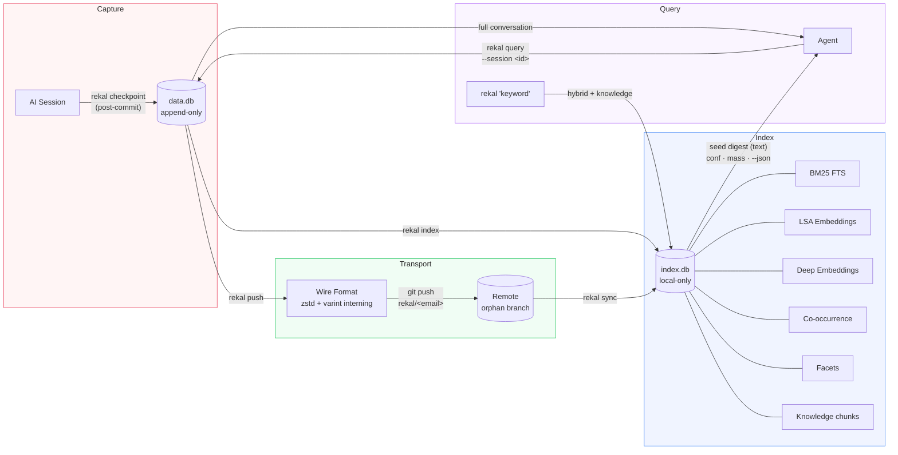

# Rekal

**Rekal is a command-line tool that captures your AI coding sessions at every git
commit, stores them in your repo, and lets any agent recall the reasoning behind
a past decision — including the approaches that were tried and rejected.**

[](https://rekal.dev)
[](https://github.com/rekal-dev/rekal-cli/releases)
[](https://github.com/rekal-dev/rekal-cli/actions/workflows/ci.yml)
[](https://arxiv.org/abs/2607.14390)
[](LICENSE)
[](https://discord.gg/hDMj8zHH2)
[](https://github.com/rekal-dev/rekal-cli/stargazers)

[Quick start](#quick-start) · [Commands](#commands-reference) · [How it works](#how-it-works) · [Team memory](#team-memory) · [Benchmarks](#benchmarks) · [Docs](#documentation) · [Paper](https://arxiv.org/abs/2607.14390) · [Discord](https://discord.gg/hDMj8zHH2)

📄 **Research published:** ["Why Git Is the Memory Solution for the Agentic Development Lifecycle"](https://arxiv.org/abs/2607.14390) on arXiv (2607.14390)

> **Memory that lives in git — shared by your team, personally adaptive as you recall.** Works with Claude Code, Cursor, Copilot, Codex, Gemini, Kiro, and OpenCode.



Every AI session settles decisions: why this approach, what got tried and thrown away. Then the session ends and that reasoning is gone. Rekal captures it at every commit, stores it **raw** in git, indexes and embeds it **locally in the background**, and shares it across your team when the work merges. There is no memory SaaS and no external memory service. Embedding is local, and the whole store is a `.rekal/` directory in your repo. Your agent recalls the conversation behind any change: the reasoning, the dead-ends already ruled out, the exact decision, in ~7.5K context tokens and a few seconds, from git.

- **Know *why*, not just *what*** — the conversation behind every change, not just the diff.
- **Stop re-deciding** — dead-ends already ruled out stay ruled out; nobody re-proposes them.
- **Team memory in git** — merged work travels with the repo over plain push/fetch. No server.
- **Personalised & adaptive** — as *you* recall, the memories you keep returning to get a usage hint and a small ranking boost. On your machine only, never synced.
- **Scrubbed before it's stored** — transcripts pass through secret redaction (pattern + entropy) and home-path anonymization before they reach the database, let alone the wire. And only *merged* work is ever shared, so an unmerged spike never leaves your machine.

## Why not just…?

| Instead of | The gap | Rekal |
|---|---|---|
| a `MEMORY.md` / `CLAUDE.md` notes file | rots, hand-maintained, tied to one branch | captured automatically at every commit, immutable, branch-aware |
| a hosted memory layer (Mem0, Zep, Letta) | a service and a vector tier to operate, your transcripts on someone else's box, memories distilled lossily up front | nothing to operate, nothing leaves the machine, raw sessions kept whole and reasoned over at query time |
| editor/agent memory (Cursor, Copilot, Claude Code) | per-user, per-tool, ephemeral, no team history | team-wide persistent memory, travels with the repo, one ledger every agent reads |
| a RAG index over your repo | indexes the code, the artifact, not the argument that produced it | indexes the conversation: the rejected options and the reason they lost |
| `git log` / `git blame` | tell you *what* changed, never *why* | the conversation and reasoning behind the change |

## Quick start

**Requirements:** git, and macOS on Apple Silicon or Linux (x86-64 / arm64).
Nothing else — no runtime, no Python, no API key, no service to run.

> **Status: 1.0 release candidate.** The store format, wire format, command
> surface and exit codes are what 1.0 intends to ship, and
> [docs/compatibility.md](docs/compatibility.md) states exactly what the
> version number will and will not cover. It says ranking and `index.db` are
> deliberately *not* frozen. If something you depend on isn't covered, say so
> now — that is what a candidate is for.

The binary is **~170 MB** to download and **~200 MB** on disk. That is the
tradeoff for a single file: the inference engine, the embedding model, the
database, and the full-text extension all ship inside it, so there is no model
download on first run, no service to start, and recall works offline.

### From Claude Code

```
/plugin marketplace add rekal-dev/rekal-cli
/plugin install rekal@rekal-dev
```

Then `/rekal:install` once per machine, and `/rekal:init` in each repo you want
memory in. Both confirm before touching anything. That's the whole setup — skip
to step 3 below.

### From a shell

```bash
# 1. Install (default: ~/.local/bin — override with --target <dir>)
curl -fsSL https://raw.githubusercontent.com/rekal-dev/rekal-cli/main/scripts/install.sh | bash

# 2. Turn it on in your repo
cd your-project
rekal init

# 3. Work as normal — commit, and your AI session is captured automatically
git commit -m "…"

# 4. In any later session, ask
rekal "why did we drop batching?"
```

<details>
<summary>Other ways to install</summary>

**Read the script before running it** — same result, nothing piped into a shell:

```bash
curl -fsSL https://raw.githubusercontent.com/rekal-dev/rekal-cli/main/scripts/install.sh -o rekal-install.sh
less rekal-install.sh
bash rekal-install.sh
```

**Download the binary yourself** from
[Releases](https://github.com/rekal-dev/rekal-cli/releases/latest) —
`rekal_darwin_arm64.tar.gz`, `rekal_linux_amd64.tar.gz`, or
`rekal_linux_arm64.tar.gz`. Each release ships `checksums.txt`; verify with
`shasum -a 256 -c checksums.txt`, then extract `rekal` onto your `PATH`.

**Pin a version** with `REKAL_VERSION=v0.2.64` in front of either command.

**Build from source** if you want to change it. `go install` alone will not
work, because the deep-embedding layer is CGO bound to a pinned llama.cpp
build. Follow [docs/DEVELOPMENT.md](docs/DEVELOPMENT.md), which has the exact
prerequisites (mise, git-lfs, cmake, the pinned llama.cpp tag).

</details>

`rekal init` sets up `.rekal/` (the store), a `post-commit`/`pre-push` git hook,
the agent skill under `.claude/skills/rekal/`, an orphan branch
`rekal/<your-email>` for transport, and one marker-tagged line in `CLAUDE.md`
pointing your agent at the skill — plus the equivalent line in the rules file of
any other agent it detects (`AGENTS.md` for Codex/Cursor/OpenCode, `GEMINI.md`,
`.github/copilot-instructions.md`, or `.kiro/steering/rekal.md` for Kiro). Your
own content is never touched. That
line is the whole developer experience for most users: init, then commit and
push as normal — your agent routes its own memory from there.

After you upgrade the binary, the next recall that sees a pinned skill-version
mismatch refreshes `.claude/skills/` in place (hooks and agent instruction
files are left alone). Re-run `rekal init` to also refresh hooks, the CLAUDE.md
marker line, and other detected-agent rules — data stays untouched.

To back Rekal out of a repo, run `rekal clean`. It asks first, then removes the
store, both git hooks, the installed skill, and the marker line from every agent
rules file it wrote — deleting a rules file it created and leaving one you
already tracked. Two things it deliberately does not touch: a `.gitignore` it
added entries to, and the local transport branch `rekal/<your-email>` (a git ref
is yours to delete — `git branch -D rekal/<your-email>`). To remove the binary
itself, delete it from wherever you installed it (default `~/.local/bin/rekal`)
along with `~/.config/rekal/` if you created a global config. Full setup,
teardown, and verification detail: **[docs/usage.md](docs/usage.md)**.

The Claude Code plugin above is setup only — `/rekal:install` and `/rekal:init`,
plus the installer it ships. The recall skill itself comes from the binary, so it
always matches the version answering your commands.

## See it in action

A decision was settled in an earlier session: webhook retries use exponential
backoff, not a fixed delay. A later agent — different session, no memory of that
— is about to propose the fixed delay again. It asks first.

Three terms carry the output. A **seed** is one candidate session, with `conf=`
its absolute confidence that it answers your query. The header line is a
**verdict** — `INJECT` (read this memory), `KNOWLEDGE` (read prose at HEAD
instead), or `SILENCE` (memory isn't the tool here). `t14` is the turn to drill
into.

```console
$ rekal "should webhook retries use a fixed delay?"
```
```text
INJECT top=0.81 gap=0.28 2 seeds
  s14 conf=0.81 t14 [reached 3× drilled 1×· "webhook retry policy"] "no, a fixed 5s delay stampedes the downstream on recovery. Use exponential backoff with jitter…"
  s31 conf=0.53 t9 "we capped retries at 5 attempts then dead-letter — anything past that never lands…"
```

Compact text by default — the whole answer in two lines, each seed keyed by a
short handle (`s14`) you pass straight to the next command.

`[reached 3× drilled 1×· …]` is your personal recall graph: search has surfaced
this memory three times and an agent actually opened it once, most often for
"webhook retry policy". The two numbers are different evidence — surfacing is
the ranker's own past output, opening is an agent's judgment — so a high reach
with no drills means "the ranker keeps offering this", not "people read this".
Local-only, never pushed.

The agent gets the decision **and the reason the alternative was rejected**, sourced from the human's own mid-course correction, before it wastes a round re-proposing it. It drills in for the full reasoning with one more call, passing the short handle straight through:

```console
$ rekal query -s s14 --role human_steering
```

Everything defaults to text an agent can act on directly; add `--json` when a program needs to parse it — the same result carries `score` (rank within the set, max-normalized), absolute `confidence`, and raw BM25 `mass`, so a silence gate can reject a query that is merely the best of a weak set:

```console
$ rekal --json "should webhook retries use a fixed delay?"
```
```json
{
  "query": "should webhook retries use a fixed delay?",
  "mode": "hybrid",
  "total": 2,
  "results": [
    {
      "session_id": "01JNQX8F2K9M", "sid": "s14",
      "score": 0.87, "confidence": 0.81, "mass": 5.4,
      "snippet": "no, a fixed 5s delay stampedes the downstream on recovery. Use exponential backoff with jitter…",
      "snippet_turn_index": 14,
      "snippet_role": "human_steering",
      "session": { "author": "dev@team.dev", "branch": "feat/webhooks", "commit": "a1b2c3d" }
    }
  ]
}
```

## Commands reference

| Command | Description |
|---------|-------------|
| `rekal init` | Initialize Rekal in the current git repository |
| `rekal clean` | Remove Rekal setup from this repository |
| `rekal version` | Print the CLI version |
| `rekal checkpoint` | Capture the current session after a commit |
| `rekal push [--rebuild]` | Push Rekal data to the remote branch (merged work only; append-only — no force) |
| `rekal sync [--self]` | Sync team context from remote rekal branches |
| `rekal index [--include-all\|--include <repo>\|--no-local]` | Rebuild the index DB (atomic temp→rename); optionally fold in cross-repo local sessions |
| `rekal embed` | Fill missing semantic embeddings (resumable; also started after index/sync) |
| `rekal log [--limit N]` | Show recent checkpoints |
| `rekal find "<term>" [role]` | Enumerate every ledger mention of a term (complete, time order) |
| `rekal [--file <re>] [--commit <sha>] [--author <email>] [--actor human\|agent] [-n N] [--explain] [--json] [query]` | Hybrid search → seed digest by default; `--json` for raw structured results; `--explain` adds per-layer scores |
| `rekal query --session <id> [--role <r>] [--offset N] [--limit N] [--full] [--json]` | Drill into a session — readable turns by default; `--json` for one object |
| `rekal query --sql "<sql>" [--index] [--json]` | Raw SQL → TSV by default; `--json` for NDJSON |

Full details: [docs/spec/command/](docs/spec/command/).

## What makes Rekal different

These are consequences of the design, not features bolted on. The reasoning
behind each one is in [SOUL.md](SOUL.md).

- **One immutable source of truth, and a disposable index.** Your sessions land in an append-only `data.db` **raw** — no LLM pre-summarization, no lossy "memory" distillation. The derived `index.db` (full-text + embeddings) is a pure function of that ledger, so it can never drift the way a separate memory store does: a rebuild always reconciles it, and because it's disposable the heavy passes run in the background, hard-timeboxed, and your commit never waits. Thin on the wire, rich on the machine.
- **Local embedding, no external memory service.** Embeddings are computed by an on-device model; retrieval (lexical, graph, and deep semantic) runs on your machine. No memory SaaS, no vector-DB tier, no session text leaving the box (unless you explicitly point embeddings at a remote endpoint).
- **Personalised, adaptive recall graph.** Every recall links a session to the query that reached it — on *your* machine only (never pushed or synced). Well-trodden memories surface with a `[reached N×]` hint and, by default, rank a little higher (`reach_boost`). Self-activating; inert until *you* accumulate edges. See [docs/design/recall-graph.md](docs/design/recall-graph.md).
- **Intent in git.** Not in a separate system, not behind someone else's service. Orphan branches, full history, travels with the repo. No servers, no APIs, no telemetry.
- **Single binary.** Everything embedded — database, embeddings, inference engine, compression. Zero setup. Just `rekal init` and commit.
- **Provenance.** Every answer traces back: the turn, the session, the commit it produced, the reasoning it captured. Full graph.
- **Agent-first output.** A compact text digest built for an agent to act on: verdict, per-seed confidence, drill pointers, with structured JSON one `--json` away. Silence gates and confidence thresholds, not prose.

The full version: [SOUL.md](SOUL.md).

## Team memory

This is the payoff: your team's reasoning, shared without a server. Rekal data
rides plain git on orphan branches named `rekal/<email>` — no common ancestor
with your code, so it never touches your history, merges, or working tree.

- **`rekal sync`** fetches teammates' branches and folds their sessions into
  your local index — team context before you start working.
- **Merged work only.** Your local store keeps *every* branch at full fidelity,
  but only work that **landed on the default branch** reaches the wire (ancestor
  of `main`, or a squash-merge detected by patch-equivalence — no heuristics).
  Unmerged spikes stay local; a dead-end never leaks to the team, and merged
  work ships automatically on the next push.
- **Cross-repo recall (optional)** can span every local session on your machine,
  index-only so it's structurally unshareable.
- **Redacted before storage.** Every transcript runs through secret redaction
  (pattern matching plus a Shannon-entropy check for high-entropy tokens) and
  home-directory path anonymization *before* it is written to `data.db` — so
  the scrub happens once, at capture, and nothing unscrubbed can reach the
  wire later. It is best-effort pattern matching, not a proof: a redaction
  miss is a security issue we want reported, and if a secret does land in the
  ledger, **rotate the credential first** — see [SECURITY.md](SECURITY.md) for
  the remedy and the threat model.

Team memory is the shared session ledger. The recall graph is separate:
personal and local — it adapts to *your* access patterns and never rides the
wire. Full workflow: **[docs/usage.md](docs/usage.md)**.

## Knowledge layer

Recall isn't only past sessions. Rekal also chunks your repo's prose at HEAD
(`README`, `docs/`, design notes) into a **knowledge** substrate, so a question
about a current convention returns a pointer to the authoritative file and lines
rather than an old conversation — the `KNOWLEDGE` verdict in the digest above.

The digest holds knowledge hits to a relevance floor, so on a repo with only a
file or two of prose a match can score below it and you'll get `SILENCE` where
you expected `KNOWLEDGE`. That is the gate working as designed — it would
rather stay quiet than pad an answer — but it means the layer earns its keep on
a real corpus, not on a fresh test repo. `rekal --json "<q>"` always shows the
raw knowledge hits and their scores, gate or no gate.

Design: [docs/design/knowledge-layer.md](docs/design/knowledge-layer.md).

## How it works


```mermaid
flowchart LR
    subgraph capture ["Capture"]
        A["AI Session"] -->|"rekal checkpoint<br/>(post-commit)"| B[("data.db<br/>append-only")]
    end

    subgraph transport ["Transport"]
        B -->|"rekal push"| C["Wire Format<br/>zstd + varint interning"]
        C -->|"git push<br/>rekal/&lt;email&gt;"| D[("Remote<br/>orphan branch")]
    end

    subgraph index ["Index"]
        B -->|"rekal index"| E[("index.db<br/>local-only")]
        D -->|"rekal sync"| E
        E --- F["BM25 FTS"]
        E --- G["LSA Embeddings"]
        E --- N["Deep Embeddings"]
        E --- H["Co-occurrence"]
        E --- I["Facets"]
        E --- KN["Knowledge chunks"]
    end

    subgraph query ["Query"]
        J["rekal 'keyword'"] -->|"hybrid + knowledge"| E
        E -->|"seed digest (text)<br/>conf · mass · --json"| K["Agent"]
        K -->|"rekal query<br/>--session &lt;id&gt;"| B
        B -->|"full conversation"| K
    end

    style capture fill:#fff5f5,stroke:#e94560,color:#333
    style transport fill:#f0fdf4,stroke:#22c55e,color:#333
    style index fill:#f0f4ff,stroke:#3b82f6,color:#333
    style query fill:#faf5ff,stroke:#a855f7,color:#333
```

The flow: commit → capture → push → sync → recall.

### Developer touchpoints

| You do | Rekal does |
|--------|------------|
| `rekal init` (once per repo) | Creates `.rekal/`, installs git hooks, writes the agent skill (tip + scripts + references) |
| `git commit` | Hook runs `rekal checkpoint` — snapshots your active AI session into `data.db` (append-only) |
| `git push` | Hook runs `rekal push` — encodes only your unexported data into compact wire format (zstd + string interning) and pushes to your orphan branch `rekal/<email>` |
| `rekal sync` (manual, when you want team context) | Fetches teammates' orphan branches, imports their sessions into your local DB and rebuilds the search index |
| `rekal clean` (if needed) | Removes `.rekal/` and hooks from the repo |

Day-to-day: commit and push as normal. Everything else is automatic.

### What your agent does

Your agent recalls with `rekal "<query>"` — the compact seed digest it acts on
directly — and drills into any session with `rekal query --session <id>`,
controlling how much context it loads: search first, drill progressively, full
sessions only when needed. The complete command surface and the
progressive-loading pattern are in **[docs/usage.md](docs/usage.md)**.

### The agent skill

`rekal init` installs one Claude Code skill under `.claude/skills/rekal/`. It is
a thin route: the agent classifies each question and sends it to one substrate —
**tree** (grep, now), **knowledge** (prose at HEAD), **ledger** (past
reasoning), or **map** (structure). For a ledger question, a second step
classifies the *answer type* and loads exactly one specialist workflow, so
"how long", "how many", and "when" each get concentrated, non-overlapping
guidance. Retrieval and navigation are commands in the binary; the skill is
judgment, not scripts.

Full skill reference: **[docs/usage.md#the-agent-skill](docs/usage.md#the-agent-skill)** ·
every command and flag: **[docs/commands.md](docs/commands.md)** ·
design: [docs/design/skill-router.md](docs/design/skill-router.md).

### Under the hood

Two local DuckDB databases keep the split clean: `data.db` (append-only truth,
the only thing pushed) and `index.db` (rebuildable local intelligence — FTS,
embeddings, the recall graph, knowledge chunks). Linked git worktrees share one
store. The databases, transport, and cross-repo recall are covered in
**[docs/usage.md](docs/usage.md)**.

## Configuration

Rekal is zero-config by default. To tune ranking weights — the hybrid layer
mix, the facet layer, and the recency / recall-graph reach boosts — or point
deep embeddings at an OpenAI-compatible endpoint (vLLM, Ollama, LM Studio, TEI),
there is exactly one file — `.rekal/config.json`, gitignored and local-only,
never committed. See **[docs/configuration.md](docs/configuration.md)**.

## The research

The design is argued and measured in our paper — *"Why Git Is the Memory
Solution for the Agentic Development Lifecycle"* ([arXiv:2607.14390](https://arxiv.org/abs/2607.14390), 
[PDF](https://arxiv.org/pdf/2607.14390)): memory bound to git inherits
its hard guarantees instead of rebuilding them; retrieval is closed as a
seed-supply problem (honest grep floors, a mechanism study, the facet term);
and a gated router answers each question kind — structure, episode, or
rationale — at a few hundred tokens per question. The benchmark labels
itself from your own commit–session links, so every result is replicable on
your own history at zero annotation cost. See [docs/research/](docs/research/) for details.

### Benchmarks

On two public long-term-memory benchmarks, Rekal reaches strong answer
quality with **no memory layers and no external memory service** — retrieval
runs locally over git. The answering agent is **GPT-5 Sol**; Rekal supplies the
memory, the model supplies the answer:

| Benchmark | Accuracy | Recall@20 | Context tokens/query | Agent turns/query | Time/query (agent) |
|---|---|---|---|---|---|
| LoCoMo | 90.57% | 98.61% | ~7.5K | 5.9 | a few seconds |
| LongMemEval | 86.60% | 99% | ~10.5K | 6.6 | a few seconds |

| Additional metric (LoCoMo) | Result |
|---|---|
| Recall@10 | 93.60% |
| Recall@5 | 86.44% |
| Official F1 | 63.0 |
| Typical answer output | ~78–80 tokens |
| L1 / L2 memory layers | None |
| External memory service | None |

These runs use the **shipped skill** in the loop, not a hand-tuned harness, so
accuracy tracks the answering model and climbs toward the Top-20 recall ceiling
as the right seeds get surfaced. Reproduce them — or run the self-labeling
benchmark on your own history at zero annotation cost — with the harness in
[`scripts/bench/`](scripts/bench/); the full run sequence is
[docs/research/RUN.md](docs/research/RUN.md).

**Local store, wire & recall latency** (Rekal's own coding sessions, Apple M4 —
6 Claude transcripts / 14 sessions, 473 turns; pure `rekal`, no answering model):

| Metric | Result |
|---|---|
| Raw JSONL | 8.5 MB |
| Wire | 54 KB (**~158×**) |
| `data.db` | 5.8 MB |
| `index.db` | 10.8 MB |
| Local store (`data` + `index`) | 16.5 MB |
| Recall latency | median **~150 ms** (p95 ~210 ms) |
| LoCoMo synthetic recall | median ~350 ms (p95 ~400 ms) |
| In-process search | ~76 ms |

Time/query in the accuracy table is end-to-end agent answering; these rows are
retrieval and footprint alone. Wire reduction is vs the raw agent transcript
(strip tool outputs / file bodies / JSONL chrome, then zstd) — see [SOUL.md](SOUL.md).
Local DBs stay rich on the machine; only the wire is thin.

**The trade we make on purpose.** Rekal never distills your sessions into lossy
"memories." The ledger stays raw and append-only; the index is a disposable
accelerator that a one-command rebuild reconciles back to it. So nothing is
pre-baked and nothing can rot — the reasoning happens at query time, over the
real record, and the one expensive write-time step runs in the background,
hard-timeboxed, so your commit never waits. The cost is that answering is not
free; the payoff is memory that is always fresh and never needs maintaining.
And the ask itself becomes the next session, so that reasoning is captured too.

Token estimates are the visible context produced during the enhanced
hard-question runs.

## Documentation

| Guide | What's in it |
|---|---|
| [docs/usage.md](docs/usage.md) | The two databases, orphan branches & merged-work-only sharing, worktrees, the full agent command surface, the skill, cross-repo recall |
| [docs/configuration.md](docs/configuration.md) | `.rekal/config.json` — ranking weights, embedding backends, API-key handling |
| [docs/compatibility.md](docs/compatibility.md) | What the version number promises: store, wire, flags, exit codes — and what is deliberately not covered |
| [CHANGELOG.md](CHANGELOG.md) | What changed, release by release |
| [docs/spec/command/](docs/spec/command/) | Per-command reference specs |
| [docs/research/](docs/research/) | The paper, benchmark harness, and evaluation strategy |
| [docs/DEVELOPMENT.md](docs/DEVELOPMENT.md) | Building, testing, and releasing |
| [CONTRIBUTING.md](CONTRIBUTING.md) | What a contribution has to satisfy, and what will be declined |
| [SECURITY.md](SECURITY.md) | The security model, what's in scope, how to report a vulnerability |
| [SOUL.md](SOUL.md) | The beliefs behind every design decision |

## Development

```bash
git clone https://github.com/rekal-dev/rekal-cli.git rekal-cli
cd rekal-cli
mise install
```

See [docs/DEVELOPMENT.md](docs/DEVELOPMENT.md) for the full development guide.

## Contributing

Read [SOUL.md](SOUL.md) first — it is the review bar, not a mission statement.
Then [CONTRIBUTING.md](CONTRIBUTING.md) for the checks, the doc-sync rule, and
the list of changes that will be declined before you spend a weekend on them.

Everyone participating is expected to follow the
[Code of Conduct](CODE_OF_CONDUCT.md).

Security vulnerabilities go through [SECURITY.md](SECURITY.md), never a public
issue.

## Getting help

```bash
rekal --help
rekal <command> --help
```

Issues: [github.com/rekal-dev/rekal-cli/issues](https://github.com/rekal-dev/rekal-cli/issues)

## Citation

If you use Rekal or build on the research, please cite the paper:

```bibtex
@misc{guo2026rekal,
  title         = {Why Git Is the Memory Solution for the Agentic Development Lifecycle},
  author        = {Guo, Frank},
  year          = {2026},
  eprint        = {2607.14390},
  archivePrefix = {arXiv},
  primaryClass  = {cs.SE},
  url           = {https://arxiv.org/abs/2607.14390}
}
```

## License

Apache-2.0 — see [LICENSE](LICENSE).
