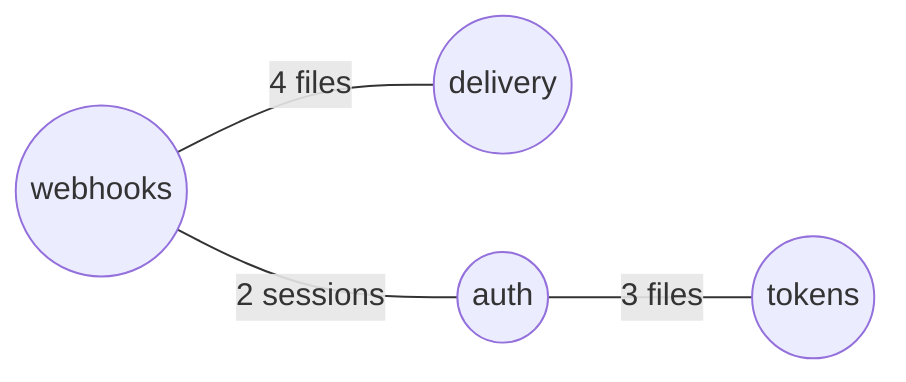

# Rekal — Wiki Materialization

Search answers a question you already have. A wiki answers the question you
don't know to ask yet: *what are the topics of this repo, and what do we know
about each?* This skill builds that wiki **from the ledger, not from the
files**: topics come from Rekal's correlation structure (file co-occurrence,
session groupings), summaries come from the sessions that did the work, and
every claim links back to its evidence.

Three design rules, non-negotiable:

1. **The graph stays virtual.** No graph store, no side database. Topic
   clusters are computed from `file_cooccurrence`/`files_index` at generation
   time; the only persisted artifact is markdown in the repo.
2. **Pages are commits.** Output lands on a branch as ordinary files and goes
   through review. The merge gate — not a judge model — is what admits a page
   into shared knowledge. Never push wiki pages to the default branch
   directly.
3. **Distrust dirty commit messages, never the sessions behind them.** A
   commit named "update" carries no signal — cite its SHA but derive the
   *why* from the session that produced it. That session is exactly what
   Rekal kept when the message didn't.

## When to Use

- Bootstrap a knowledge base from a repo with real Rekal history
- A KB/docs repo with thousands of files where a manual topic map is
  infeasible — let co-occurrence find the clusters
- Regenerate pages that have gone stale (sessions newer than the page)
- History navigable only through Rekal because commit messages are noise

## Workflow

### 0. Preconditions and freshness

```bash
ls .rekal || exit                       # initialized repo only
rekal index                             # fresh index; re-tags summaries too
```

### 1. Scope and budget

Like the census, never start unbounded. Decide the run's scope first: whole
repo, a subtree (`--file 'docs/runbooks/'`-style path prefix), or "top K
topics" (default K=10 per run). Check the size of the job:

```bash
rekal query --index "SELECT count(*) FROM session_facets"
rekal query --index "SELECT count(*) FROM file_cooccurrence"
```

Thousands of files is fine — clustering happens in SQL, and you only ever
read sessions for the K topics of this run.

### 2. Discover topics — clusters of files that change together

Strong co-occurrence edges are the topic seeds. Pull the strongest edges and
grow clusters greedily (a file joins a cluster it shares an edge with;
otherwise it seeds a new one). Cap cluster count at K and cluster size at
~15 files; everything weaker waits for a later run.

```bash
rekal query --index "SELECT file_a, file_b, count FROM file_cooccurrence
  WHERE count >= 2 ORDER BY count DESC LIMIT 200"
```

Name each cluster from its dominant path segments (e.g. files under
`payments/webhooks/` → topic `webhooks`). Prefer boring, guessable names —
the page slug is `docs/wiki/<topic>.md`.

### 3. Assemble each topic — sessions first, messages last

For each cluster, find the sessions that touched its files, then read them
cheapest-first:

```bash
# the sessions behind this topic
rekal query --index "SELECT DISTINCT session_id FROM files_index
  WHERE file_path IN (<cluster files>)"

# cheapest overview first: compaction summaries, then intent, then steering
rekal query --session <id> --role summary
rekal query --session <id> --role human
rekal query --session <id> --role human_steering
```

**The dirty-commit rule.** When listing provenance commits, classify the
message before trusting it:

```bash
git show -s --format='%s' <sha>
```

If the subject matches noise — `update`, `updates`, `wip`, `fix`, `minor`,
`tweak`, `typo`, or is shorter than ~10 characters — do **not** quote it or
let it shape the summary. Still cite the SHA (provenance is not optional),
but source the "what changed and why" from the session's turns. Clean
subjects may be quoted normally. Keep a per-page count of noise commits; it
belongs in the page footer (it tells readers how much to trust `git log`
here).

### 4. Write the page

One file per topic, `docs/wiki/<topic>.md`, always this shape:

```markdown
# <Topic>

<2–4 sentence high-level summary: what this area is, current state.>

## Key decisions
- <decision> — [session 01ABC…], commit <sha7>
- <ruled out: dead-end, and why> — [session 01DEF…]

## Files
<the cluster's files, one line each, with a phrase on their role>

## Provenance
Sessions: 01ABC…, 01DEF… · Commits: <sha7>, <sha7> (<n> noise-message
commits omitted from quotes) · Generated by rekal-wiki on <date> from
sessions up to <max captured_at>.
```

Decisions come from `human_steering` turns (the moments a human redirected
the work) and from dead-ends (sessions on never-merged branches — see the
rekal-distill boundary library). Every claim cites a session ID: a page line
without provenance is not knowledge, it's an opinion.

### 4b. The index page — a mermaid map of the whole wiki

Alongside the topic pages, maintain `docs/wiki/index.md`: the entry point a
human (or an agent without Rekal) browses. It holds a one-line-per-topic
list and a mermaid overview graph — topics as nodes, edges where clusters
share files or sessions. GitHub renders mermaid natively, so the map costs
no tooling.

```markdown
# Wiki index



| Topic | One-liner | Sessions | Updated |
|---|---|---|---|
| [webhooks](webhooks.md) | retry/backoff design and its dead-ends | 14 | 2026-07-11 |
```

Bounds: the graph shows only materialized topics (≤ K per run, so it stays
readable — mermaid degrades fast past ~25 nodes); edges only above the same
co-occurrence threshold used for clustering; no per-file nodes on the index
(files live on topic pages). Optionally give a large topic page its own
small mermaid (a session timeline or file cluster, ≤ 15 nodes) — never more
than one diagram per page.

Regenerate the index whenever any topic page regenerates; it is derived
from the pages plus the same SQL, and must never disagree with them.

**Emit deterministically — the diff is the point.** Sort topics
alphabetically, edges by (source, target), thresholds fixed; then a re-run
over unchanged history produces an empty diff, and any non-empty diff *is*
structural drift: a new mermaid edge is a correlation that didn't exist
last run, a removed edge is one that decayed, a new node is a topic being
born. `git log docs/wiki/index.md` becomes a reviewed time series of the
project's conceptual structure — the drift that mutating graph stores
cannot show anyone, here made visible, attributable, and gated on review.
Nondeterministic ordering destroys all of this; treat a noisy diff as a
bug.

**What the index is not.** The wiki (index + pages) is a *cache of memory,
not the memory*: it answers browse-questions for the topics someone chose
to materialize. Arbitrary questions, verification, and anything newer than
a page's watermark still go through `rekal` — an agent that trusts a page
over fresh recall is reading a static snapshot and should expect it to age.
When you cite a page, check its watermark first; when in doubt, recall.

### 5. Staleness check — regenerate only what moved

Before writing a page that already exists, compare its generation watermark
(the `sessions up to <timestamp>` line) against the newest session touching
the cluster:

```bash
rekal query --index "SELECT max(captured_at) FROM session_facets WHERE
  session_id IN (<cluster sessions>)"
```

Newer sessions → regenerate. Otherwise skip — an unchanged page must not
produce a diff. Staleness is git-visible by design: `git log docs/wiki/`
dates every page, and the regeneration diff shows exactly what drifted.

### 5b. Scale: fan the topics out as a dynamic workflow

Wiki generation is a large-read job with a natural decomposition: topics
are independent, and one topic's sessions fit one context window. On
anything beyond a handful of topics, run it as a workflow instead of one
long session:

- **Trunk** (cheap, no session reads): clustering SQL (step 2), spawn one
  subagent per topic, then the reduce below.
- **One subagent per topic**: receives the cluster's file list + session
  IDs, does the cheapest-first reads (step 3), writes its single
  `docs/wiki/<topic>.md`, returns only the page path and its one-liner.
- **Reduce** (trunk): validate each page (provenance lines present,
  watermark set), build `index.md` from the pages plus the clustering SQL
  — the trunk never reads raw sessions.

This keeps every context bounded regardless of repo size, and it has a
property worth knowing: Rekal captures each subagent transcript with
`parent_session_id` and `workflow_name`, so after the run the ledger holds
the full lineage of the generation job. The cost of distillation is
measurable from the store it distilled:

```bash
rekal query --index "SELECT session_id, turn_count, tool_call_count
  FROM session_facets WHERE workflow_name = '<run name>'"
```

Recall already down-weights these subagent sessions, and every page cites
the *original* sessions — the meta-work records itself without polluting
what it recorded.

### 6. Ship as a branch

```bash
git checkout -b wiki/<date>
git add docs/wiki/ && git commit -m "wiki: <K> topic pages from session history"
```

Open a PR; reviewers are the admission gate. The session in which you built
the wiki is itself checkpointed on merge — pages have provenance too, and
the loop closes on the same ledger.

## Guardrails

- Bounded always: K topics per run, ~15 files per cluster, summaries read
  before raw turns. A 3000-file repo is many runs, not one big one.
- Never push to the default branch; never bypass review.
- Never quote a noise commit message as evidence; never drop the SHA either.
- Every summary sentence must be traceable to a cited session. If no session
  covers a cluster, say so on the page ("no captured history") rather than
  inventing an account from file contents.
- Do not edit pages by hand and regenerate over the edits silently — if a
  page has manual commits since generation, flag it in the PR body instead
  of overwriting.
- Keep the meta-work out of the record's foreground: sessions spent
  generating the wiki are captured like any other. If they start crowding
  real work out of recall results, scope queries away from them
  (`rekal --file '<subsystem>/' "<q>"` or exclude `docs/wiki/` paths) —
  original sessions, which every page cites, remain the evidence.
