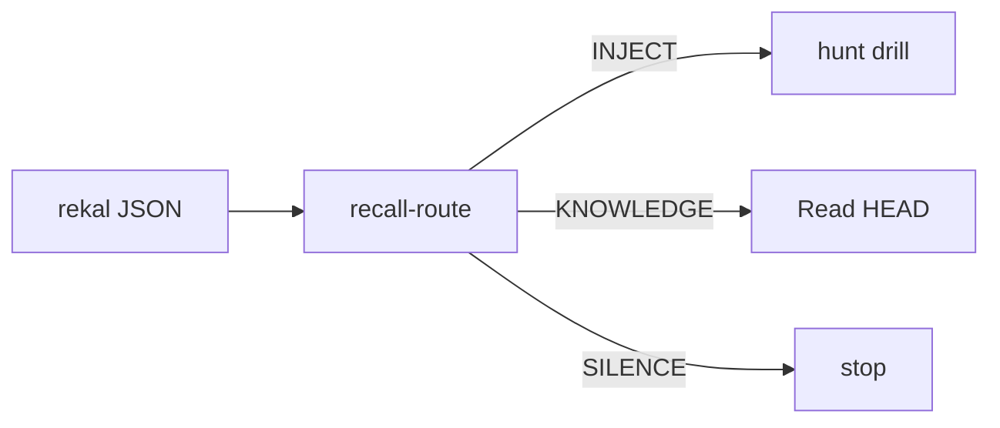

# Reference — flags, PATH, SQL, schema

## PATH

If `rekal` is missing: `export PATH="$HOME/.local/bin:$PATH"`.

## Skill root

```bash
ROOT="${CLAUDE_SKILL_DIR:-$(git rev-parse --show-toplevel)/.claude/skills/rekal}"
```

Scripts under `$ROOT/scripts/` are the gates. Prefer `python3` / `bash` so
mode bits never matter.

## Root recall flags

| Flag | Description |
|------|-------------|
| `--file <regex>` | Filter by file path (regex, git-root-relative) |
| `--commit <sha>` | Filter by git commit SHA |
| `--author <email>` | Filter by author email |
| `--actor <human\|agent>` | Filter by actor type |
| `-n`, `--limit <n>` | Max results (default 20; 0 = no limit) |
| `--explain` | Adds `layers` + `related` (file-sharing sessions) |

## Cross-repo local import (index-only, never pushed)

```bash
rekal index --include-all
rekal index --include /path/to/repo
rekal index --no-local
```

Hits carry `origin`. Suggest widening when a search misses but the problem
smells solved elsewhere — don't widen unprompted.

## Raw SQL

```bash
rekal query "SELECT id, user_email, branch FROM sessions ORDER BY captured_at DESC LIMIT 5"
rekal query --index "SELECT * FROM file_cooccurrence WHERE file_a LIKE '%auth%' ORDER BY count DESC"
```

`rekal query --help` documents both DB schemas. `tool_calls.path` is the most
complete "files this session touched" source.

## Semantic embeddings

Structural index finishes first; deep vectors continue via `rekal embed`
(background after `index`/`sync`). Keyword/LSA/knowledge-FTS work immediately.

## Gate scripts (quick map)

| Script | Role |
|---|---|
| `recall-route.py` | Tip entry: KNOWLEDGE / INJECT / SILENCE |
| `hunt-gate.py` | Episode bars (used by recall-route) |
| `why-trail-gate.py` | WHY gather size |
| `map-fresh.sh` | Map watermark vs HEAD |
| `map-write-watermark.sh` | Write/refresh watermark (+ stub) |
| `wiki-branch-gate.sh` | Refuse wiki on default branch |



Confident episode → INJECT even when knowledge docs are present. Knowledge is
the fallback when the episode gate fails.
