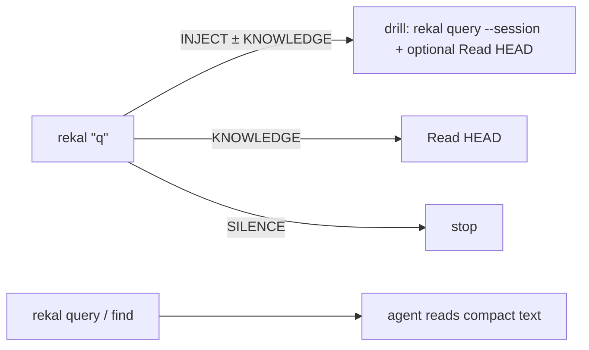

# Reference — flags, PATH, SQL, schema

## PATH

If `rekal` is missing: `export PATH="$HOME/.local/bin:$PATH"`.

## Commands

Every read command prints **compact agent-readable text by default**; add
`--json` only when a program must parse it. Retrieval and navigation are all
`rekal` subcommands — no scripts, no pipes:

- `rekal "<q>"` — recall → seed digest. `--also "<framing>"` (repeatable) fuses
  extra phrasings.
- `rekal find "<term>" [role]` — complete, time-ordered mention sweep.
- `rekal when <YYYY-MM-DD> "<phrase>"` — relative→absolute date.
- `rekal query --session <id>` / `rekal query --sql "…"` — drill / SQL, text by
  default.

The `map.sh` and `wiki-gate.sh` workflow gates remain under
`$(git rev-parse --show-toplevel)/.claude/skills/rekal/scripts/`.

## Root recall flags

| Flag | Description |
|------|-------------|
| `--file <regex>` | Filter by file path (regex, git-root-relative) |
| `--commit <sha>` | Filter by git commit SHA |
| `--author <email>` | Filter by author email |
| `--actor <human\|agent>` | Filter by actor type |
| `-n`, `--limit <n>` | Max results (default 20; `0` = empty set; negative rejected) |
| `--explain` | Adds `layers` + `related` (file-sharing sessions) |
| `--also <framing>` | Additional phrasing of the same question; RRF-fused into one seed (repeatable) |
| `--json` | Raw structured JSON instead of the default seed digest (machine consumers) |

## Cross-repo local import (index-only, never pushed)

```bash
rekal index --include-all
rekal index --include /path/to/repo
rekal index --no-local
```

Hits carry `origin`. Suggest widening when a search misses but the problem
smells solved elsewhere — don't widen unprompted.

## Raw SQL

```bash
rekal query --sql "SELECT id, user_email, branch FROM sessions ORDER BY captured_at DESC LIMIT 5"
rekal query --index --sql "SELECT * FROM file_cooccurrence WHERE file_a LIKE '%auth%' ORDER BY count DESC"
```

`rekal query --help` documents both DB schemas. `tool_calls.path` is the most
complete "files this session touched" source. Rows print as TSV by default;
`--json` for NDJSON. A SQL error is printed verbatim (not an empty set).

- `turns.ts` is a **TIMESTAMP**: `ts LIKE '2023-05%'` throws a Binder error
  (wrongful absence on temporal questions). Use
  `ts BETWEEN TIMESTAMP '2023-05-01' AND TIMESTAMP '2023-06-01'` or
  `CAST(ts AS VARCHAR) LIKE '2023-05%'`.

## Semantic embeddings

Structural index finishes first; deep vectors continue via `rekal embed`
(background after `index`/`sync`). Keyword/LSA/knowledge-FTS work immediately.

## Command map

| Command | Role |
|---|---|
| `rekal "<q>"` | Recall → seed digest (INJECT / KNOWLEDGE / SILENCE). Super-low floors; you judge `conf=` / `path=score`. `--json` for raw |
| `rekal "<q>" --also "<f>"` | Multi-framing recall, RRF-fused — widen a weak single-phrasing recall |
| `rekal query --session <id>` / `--sql "…"` | Drill / SQL → readable turns or TSV rows (no JSON chrome); `--json` for raw; SQL errors printed verbatim |
| `rekal find "<term>" [role]` | Every ledger mention of a term, time order, complete — enumeration without hand-SQL |
| `rekal when <anchor> "<phrase>"` | Relative phrase → absolute date (or honest window); pure calendar, no store |
| `bash scripts/map.sh fresh` / `watermark` | Map watermark vs HEAD / write-refresh (+ stub) |
| `bash scripts/wiki-gate.sh` | Refuse wiki on default branch |


