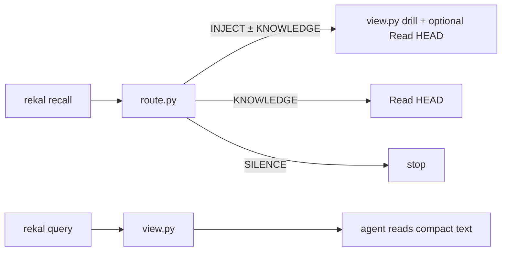

# Reference — flags, PATH, SQL, schema

## PATH

If `rekal` is missing: `export PATH="$HOME/.local/bin:$PATH"`.

## Skill root

```bash
ROOT="${CLAUDE_SKILL_DIR:-$(git rev-parse --show-toplevel)/.claude/skills/rekal}"
```

Scripts under `$ROOT/scripts/` compress every skill-facing rekal. Prefer
`python3` / `bash` so mode bits never matter. **Never read raw JSON** — pipe
recall through `route.py`, query/SQL/session through `view.py`.

## Root recall flags

| Flag | Description |
|------|-------------|
| `--file <regex>` | Filter by file path (regex, git-root-relative) |
| `--commit <sha>` | Filter by git commit SHA |
| `--author <email>` | Filter by author email |
| `--actor <human\|agent>` | Filter by actor type |
| `-n`, `--limit <n>` | Max results (default 20; `0` = empty set; negative rejected) |
| `--explain` | Adds `layers` + `related` (file-sharing sessions) |

## Cross-repo local import (index-only, never pushed)

```bash
rekal index --include-all
rekal index --include /path/to/repo
rekal index --no-local
```

Hits carry `origin`. Suggest widening when a search misses but the problem
smells solved elsewhere — don't widen unprompted.

## Raw SQL

```bash
rekal query "SELECT id, user_email, branch FROM sessions ORDER BY captured_at DESC LIMIT 5" \
  | python3 "$ROOT/scripts/view.py"
rekal query --index "SELECT * FROM file_cooccurrence WHERE file_a LIKE '%auth%' ORDER BY count DESC" \
  | python3 "$ROOT/scripts/view.py"
```

`rekal query --help` documents both DB schemas. `tool_calls.path` is the most
complete "files this session touched" source.

## Semantic embeddings

Structural index finishes first; deep vectors continue via `rekal embed`
(background after `index`/`sync`). Keyword/LSA/knowledge-FTS work immediately.

## Gate scripts (quick map)

| Script | Role |
|---|---|
| `route.py` | Recall → recommendation digest (INJECT / KNOWLEDGE / SILENCE). Super-low floors; agent judges `conf=` / `path=score` |
| `view.py` | Query/SQL/session → raw turns or TSV rows (no JSON chrome) |
| `map.sh fresh` / `map.sh watermark` | Map watermark vs HEAD / write-refresh (+ stub) |
| `wiki-gate.sh` | Refuse wiki on default branch |


