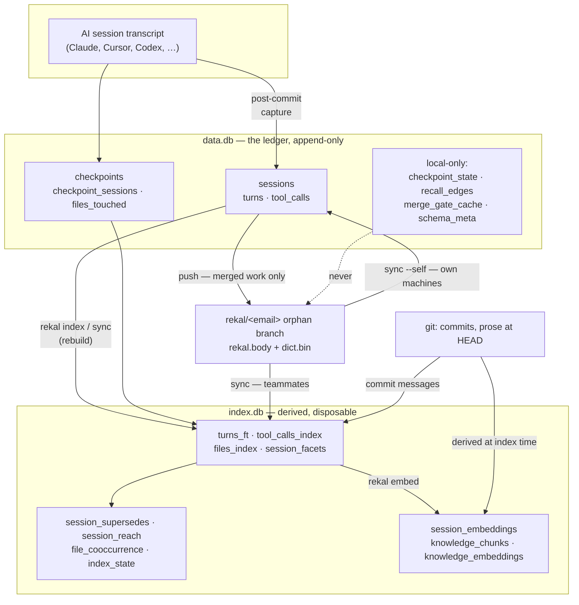

# The two databases, at a glance

Rekal keeps two DuckDB files in `.rekal/`. Which one a table lives in is the
whole design, so start here before [`README.md`](README.md)'s column-by-column
detail.

|  | `data.db` | `index.db` |
|---|---|---|
| Role | the ledger — what happened | derived intelligence — how to find it |
| Writes | **append-only** | rebuilt freely |
| Safe to delete? | **never** | yes — `rekal index` rebuilds it |
| Leaves the machine? | parts of it, encoded on the wire | never |

Everything corrective — collapsing duplicates, reclassifying roles, ranking —
happens in `index.db`, because the ledger only ever gains rows.

## What `.tables` shows

```
$ duckdb .rekal/data.db -c ".tables"
checkpoint_sessions  checkpoint_state  checkpoints  files_touched
merge_gate_cache     recall_edges      schema_meta  sessions
tool_calls           turns
```

```
$ duckdb .rekal/index.db -c ".tables"
file_cooccurrence  files_index        index_state       knowledge_chunks
knowledge_embeddings  session_embeddings  session_facets  session_reach
session_supersedes    tool_calls_index    turns_ft
```

You do not need `duckdb` installed — `rekal query --sql "…"` reads `data.db`
and `rekal query --index --sql "…"` reads `index.db`, both read-only.

`merge_gate_cache` is created on demand, so it is absent until the first push.
Tables ending `_fts_*` may also appear: those are DuckDB's own FTS internals,
built by `PRAGMA create_fts_index`. Ignore them; they are not part of the model.

## How the two relate



Two arrows carry the design:

- **`data.db → index.db` is one-way and rebuildable.** Delete `index.db` and
  `rekal index` reconstructs every one of those tables. Nothing is lost.
- **`data.db → wire` is filtered.** Only merged work is encoded, and four tables
  never travel at all.

## Table by table

### `data.db` — the ledger

| Table | Holds | On the wire? |
|---|---|---|
| `sessions` | one row per conversation: author, branch, agent, parent | **yes** |
| `turns` | every turn, ordered by `turn_index` | **yes** |
| `tool_calls` | tool, path, first 100 chars of a command — never output | **yes** |
| `checkpoints` | one per commit captured: `git_sha`, branch, author | **yes** |
| `checkpoint_sessions` | which conversations a commit produced | **yes** |
| `files_touched` | files each commit changed | **yes** |
| `checkpoint_state` | transcript → session mapping, so re-capture appends | **no** |
| `recall_edges` | what you searched for and what you opened | **no** |
| `merge_gate_cache` | memoized merged-only verdicts per mainline tip | **no** |
| `schema_meta` | stamped schema version | **no** |

The four local-only tables are deliberate, and `recall_edges` is the clearest
case: it holds query text, so exporting it would publish what each developer
searched for. See [SECURITY.md](../../SECURITY.md).

### `index.db` — derived

| Table | Built from | Used for |
|---|---|---|
| `turns_ft` | `data.db.turns` + wire imports | BM25 keyword search |
| `tool_calls_index` | `data.db.tool_calls` | facet signal, co-occurrence |
| `files_index` | `files_touched` × `checkpoint_sessions` | `--file` filter, the map route |
| `session_facets` | the index's own tables + git | per-session ranking material: author, branch, `git_sha`, `commit_message`, `facet_text` |
| `session_supersedes` | duplicate detection | old → surviving session, so one conversation is one seed |
| `session_reach` | `data.db.recall_edges` | the `[reached N×]` hint |
| `session_embeddings` | session text | LSA + deep-semantic vectors |
| `knowledge_chunks` | tracked prose at HEAD | the KNOWLEDGE layer |
| `knowledge_embeddings` | those chunks | semantic search over prose |
| `file_cooccurrence` | tool-call paths within a session | related-file signal |
| `index_state` | the build itself | counts, schema version, embed model |

## Two things that look like duplication and are not

**`turns` and `turns_ft` hold the same text.** `turns_ft` is not a copy for
convenience — it is where corrections live. Compaction summaries stored as
`human` before the `summary` role existed are reclassified there on read;
`data.db` keeps the original because it is append-only. It also holds teammate
turns that `data.db` has never seen.

**`session_facets` restates session metadata.** It is per-session ranking
material, including things `data.db` cannot hold: `commit_message`, resolved
locally from your own clone rather than shipped, and `facet_text`, the document
the facet layer searches.

## The lifecycle

1. **`git commit`** → post-commit runs `rekal checkpoint`: the transcript is
   parsed, scrubbed, and appended to `data.db`. A conversation spanning several
   commits **grows one session** rather than becoming several.
2. **`rekal index`** → rebuilds `index.db`: FTS, facets, duplicate collapse,
   LSA, knowledge chunks. Deep-semantic vectors follow in the background via
   `rekal embed`.
3. **`git push`** → pre-push runs `rekal push`: merged checkpoints are encoded
   into `rekal.body` and appended to the `rekal/<email>` orphan branch.
4. **`rekal sync`** → teammates' branches decode into `index.db` only.
   `--self` is the exception: your own branch imports into `data.db`, because
   that is your own ledger arriving from another machine.

## Recovering

Losing `index.db` costs nothing:

```bash
rm .rekal/index.db && rekal index
```

Losing `data.db` loses the ledger. What was pushed survives on the orphan
branch and `rekal sync --self` brings it back; anything unmerged, and therefore
never pushed, is gone. That asymmetry is the reason for the split.

## See also

- [`README.md`](README.md) — column-by-column schema
- [`forward-compatibility.md`](forward-compatibility.md) — how old stores keep opening
- [`../git-transportation.md`](../git-transportation.md) — the wire format
- [`../design/merged-only-sharing.md`](../design/merged-only-sharing.md) — what reaches the wire
