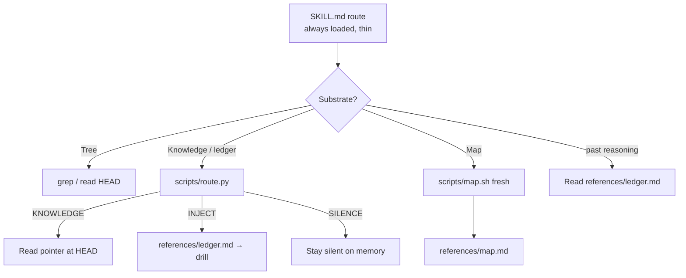
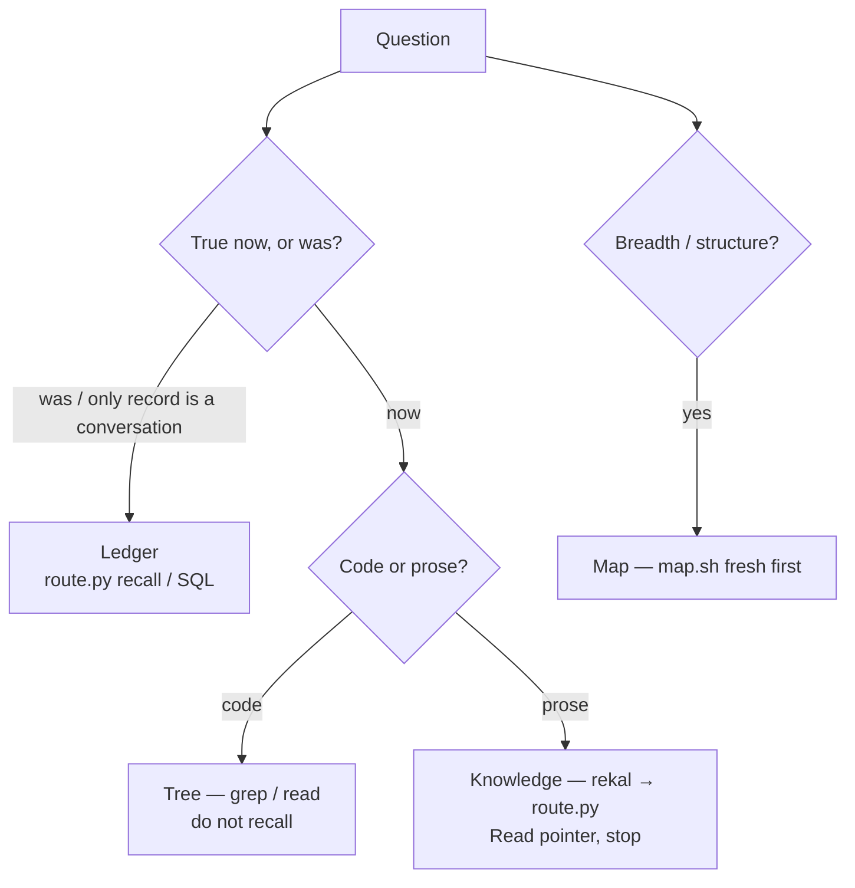
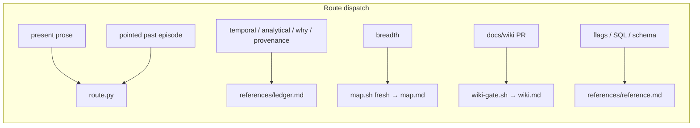

# Skill router — one thin route, three homes

The Claude Code surface is a **single** skill (`skills/rekal/`), redesigned from
`SOUL.md`'s "The skill" tenets. It is thin on the route, rich on arrival, and
organized around three homes:

- **Function → a script** — deterministic data for the agent's judgment.
- **Knowledge → rich prose, on demand** — informs judgment, never makes it.
- **Judgment → the agent's reasoning** — never frozen into a script or a rule.

The agent classifies the question, loads one module (or runs one script), and
stops. Install copies the whole tree; `clean` / refresh purge legacy companion
dirs. No corpus profiles ship — the route is general.

## Layers



| Layer | Path | Loads when |
|-------|------|------------|
| Route | `SKILL.md` | Always (triage + dispatch only; trusts reasoning) |
| Scripts | `scripts/*` | Route or reference names them — deterministic data |
| References | `references/*.md` | One `Read` after triage — then stop |

## Substrate triage



Boundary line (route): *grep for code that is · knowledge for prose that is ·
ledger for the why that was.* A fact whose only record is a past conversation is
ledger, not knowledge — so a **pure-dialogue corpus** (no code, no HEAD prose, no
structure) routes to the ledger by degeneration, with no chat profile or
separate build.

## Recall route (knowledge vs episode vs silence)

Bars live in `route.py` — not route prose. Ranking still uses max-normalized
`score`; the gate uses absolute `confidence`. **Mass is a signal, not a veto.**

```mermaid
flowchart LR
  r["rekal JSON"] --> rt["route.py"]
  rt -->|confidence≥0.70 (soft 0.68, gap≥0.04)| i["INJECT + digest<br/>even if knowledge present<br/>reports low_mass"]
  rt -->|else + knowledge≥0.40| k["KNOWLEDGE — Read HEAD"]
  rt -->|else| s["SILENCE"]
```

`confidence` = `max(saturate(bm25), cosine) + 0.15·saturate(facet)` — never
divided by the candidate-set max (junk queries also normalize `score` ≈ 1.0).
Hard floor 0.70; soft path 0.68 with gap ≥ 0.04 (above offtopic ~0.55–0.63).
Knowledge fallback requires absolute `knowledge[0].score` ≥ 0.40; knowledge is a
**fallback** when the episode gate fails, never an unconditional override.

BM25 `mass` is reported as a `low_mass` boolean, never used to silence a
confident hit: a confident low-mass hit is a real dialogue-shaped match, and the
agent's reasoning decides to trust or widen. Junk is already rejected by the
confidence floor, so no mass veto is needed.

## Other gates

| Script | Machine event |
|--------|----------------|
| `map.sh fresh` | `FRESH` / `STALE` / `MISSING` vs HEAD watermark |
| `map.sh watermark` | Write line-1 watermark (+ stub if missing) |
| `wiki-gate.sh` | Refuse wiki writes on the default branch |

## Dispatch map (route → module)



`ledger.md` is the one rich page on reasoning over the past — recall, widen,
depth-as-judgment, time-axis, enumeration, whose-fact/premise, analytical SQL,
decision arcs, provenance. One question, one substrate. The route returns data;
the agent decides the move. Cite session / turn / commit with every memory claim.
