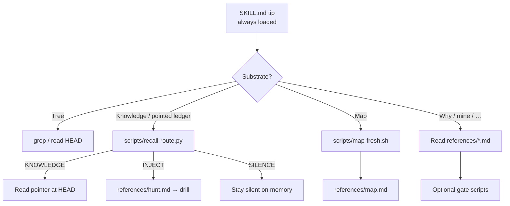
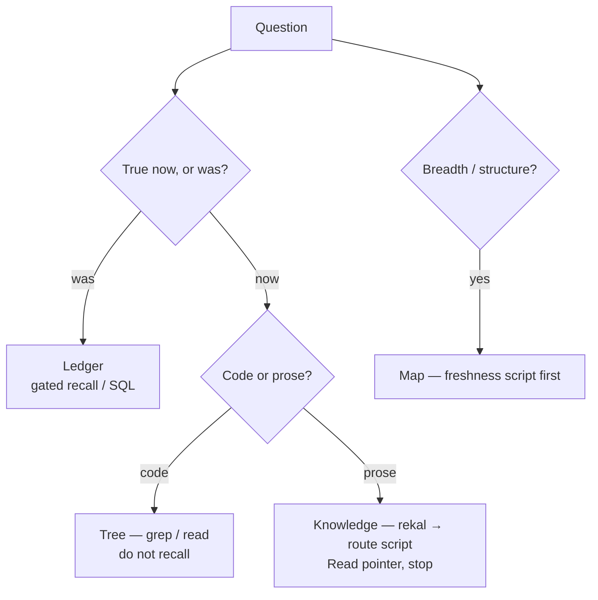
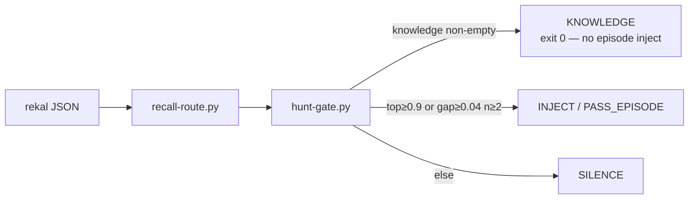
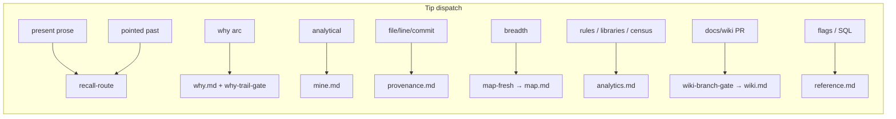

# Skill router — one tip, progressive disclosure, executable gates

The Claude Code surface is a **single** skill (`skills/rekal/`). The agent
never chooses among `rekal-*` companions. It classifies the question, loads
one module (or runs one script), and stops.

Install copies the whole tree; `clean` / refresh purge legacy companion dirs.

## Layers

| Layer | Path | Loads when |
|-------|------|------------|
| Tip | `SKILL.md` | Always (triage + dispatch only) |
| Scripts | `scripts/*` | Tip or reference names them — deterministic |
| References | `references/*.md` | One `Read` after triage — then stop |

## Substrate triage

Boundary line (tip): *grep for code that is · knowledge for prose that is ·
ledger for the why that was.*

## Recall route (knowledge vs episode vs silence)

Bars and labels live in scripts — not in tip prose.

Single result: absolute top ≥ 0.9 only (gap alone must not pass).

## Other gates

| Script | Machine event |
|--------|----------------|
| `why-trail-gate.py` | WHY synthesize only if gather rows ≥ 10 |
| `map-fresh.sh` | `FRESH` / `STALE` / `MISSING` vs HEAD watermark |
| `map-write-watermark.sh` | Write line-1 watermark (+ stub if missing) |
| `wiki-branch-gate.sh` | Refuse wiki writes on the default branch |

## Dispatch map (tip → module)

One question, one substrate. Cite session / turn / commit with every memory claim.
