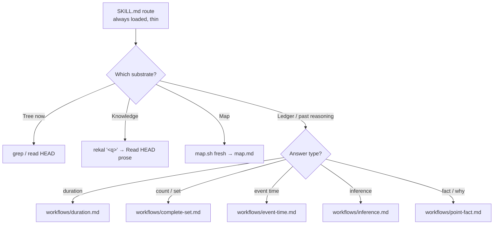
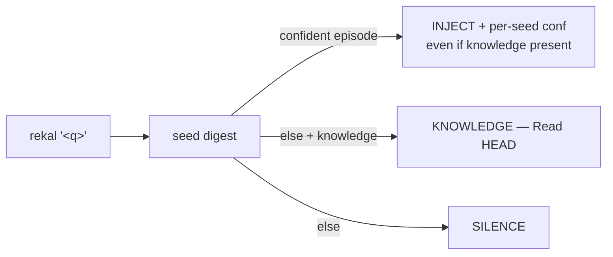

# Using Rekal

This is the operational guide: how the two databases fit together, what
travels over git and what stays local, how agents query, and how the skill
routes. For the marketing overview and quick start, see the
[README](../README.md); for tuning, see [configuration.md](configuration.md).

## Setup and teardown

```bash
cd your-project
rekal init
```

`rekal init` creates the following on your system:

- `.rekal/` directory containing `data.db` (shared truth) and `index.db` (local
  search index)
- A `post-commit` and `pre-push` git hook (marked `# managed by rekal`)
- The Claude Code skill under `.claude/skills/rekal/` (see
  [the agent skill](#the-agent-skill))
- One marker-tagged sentence in `CLAUDE.md` pointing agents at the skill
  (created if missing; your own content is never touched)
- An orphan branch `rekal/<your-email>` for transport
- Appends `.rekal/` to your `.gitignore`

Running `rekal init` again in an already-initialized repo does **not** rebuild
your store. It refreshes the version-managed skill and hooks and leaves your
data untouched — so after you upgrade the binary, `rekal init` is how skill
updates reach an existing repo. A full reinitialize still requires
`rekal clean` first.

```bash
rekal clean
```

`rekal clean` removes everything `init` created:

- Deletes the `.rekal/` directory and all its contents
- Removes the git hooks (only the ones marked `# managed by rekal`)
- Removes the installed skill (`.claude/skills/rekal/` plus any legacy
  `rekal-*` companion dirs), pruning `.claude/skills/` and `.claude/` only if
  they are left empty — your own `.claude` content is never touched
- Removes the marker-tagged `CLAUDE.md` sentence (deleting the file only if
  nothing else remains)

No residue. If you want to start over, run `clean` then `init`.

```bash
rekal version
```

When a newer release is available, the CLI prints an update notice after each
command.

## Two databases

Rekal keeps two local DuckDB databases in `.rekal/`. The split is deliberate —
thin on the wire, rich on the machine.

- **`data.db`** — the shared truth. Append-only. Sessions, turns, tool calls,
  checkpoints, files touched — every branch, merged or not. This is the only
  source `rekal push` encodes from (filtered to merged work — see below), and
  what `rekal query` reads.
- **`index.db`** — local intelligence. Full-text indexes, vector embeddings,
  file co-occurrence graphs, knowledge chunks. Never synced. Rebuilt anytime
  with `rekal index`. This is what powers `rekal "<query>"` search.

## Orphan branches and what gets shared

Rekal data lives on git orphan branches named `rekal/<email>`. These branches
have no common ancestor with your code branches — they never appear in your
project history, never affect merges, and never clutter your working tree.
Standard `git push`/`git fetch` move the data.

Your local databases keep **every** branch — full fidelity, nothing gated. The
wire is different: `rekal push` shares a session only when its code **landed on
the default branch**, detected two ways, both exact:

- its commit is an ancestor of `main` (merge-commit and rebase workflows), or
- its branch's changes landed as a **squash merge** (patch-equivalence
  detection — no heuristics)

Unmerged work simply waits: it stays local, is re-checked on every push, and
ships automatically the moment its branch merges. Abandoned branches never
qualify, so a dead-end spike never reaches your teammates. Commit everything for
yourself; share only what merged.

## Worktrees

Linked git worktrees (`git worktree add`) share **one** `.rekal/` store — the
one in the main checkout. Init once in the main repo; every worktree then reads
and writes the same data, index, and config, so there's no per-worktree
`rekal sync` or reindex. Checkpoints still record the branch and commit of
whichever worktree you committed in. A repo that never uses worktrees is
unaffected — the store is just its own `.rekal/`.

## How your agent uses it

The agent controls how much context it loads: search first, drill down
progressively, load full sessions only when needed.

| Agent does | Rekal does |
|------------|------------|
| `rekal "auth middleware"` | Hybrid search (BM25 + LSA + deep embed + facets) plus a separate `knowledge` block for prose at HEAD; returns a seed digest (INJECT/KNOWLEDGE/SILENCE + per-seed `conf` and a drill pointer), or structured `confidence` / `mass` JSON with `--json` |
| `rekal query --session <id> --offset N --limit 5` | Returns a small window of turns around the relevant part of the conversation, with `has_more` for pagination |
| `rekal query --session <id> --role human` | Returns only human turns — cheapest way to understand session intent |
| `rekal query --session <id> --full` | Returns everything: turns, tool calls, files touched — only when the agent needs full detail |
| `rekal --file src/billing/ "discount"` | Scoped search filtered by file path |
| `rekal --commit <sha>` | Finds the session(s) that produced a commit — the anchor for change provenance |
| `rekal query --session <id> --role human_steering` | Returns only the mid-course corrections — the highest-signal turns for intent and preferences |
| `rekal query --session <id> --role summary` | Returns the harness-written compaction distillations — the cheapest overview of a long session |
| `rekal sync` (optional, at session start) | Pulls team context before the agent starts working |

```bash
# Agent touches src/billing/ — first, recall prior context
rekal --file src/billing/ "discount logic"

# Agent finds a relevant session, drills into the matching turn
rekal query --session 01JNQX... --offset 10 --limit 5

# Agent loads full detail only if needed
rekal query --session 01JNQX... --full
```

## The agent skill

The raw commands above are the interface; the **skill** is the playbook.
`rekal init` installs one Claude Code skill under `.claude/skills/rekal/` — a
thin route (substrate triage + silence + dispatch) plus on-demand `references/`
and a couple of built-in gate `scripts/` (progressive disclosure). Retrieval and
navigation are commands in the binary, not scripts. The agent never picks among
skills; it classifies the question, routes to one substrate, and loads only the
module it needs. For a question that belongs to the past-reasoning **ledger**, a
second step classifies the *answer type* and loads exactly one specialist
workflow — so a "how long", a "how many", and a "when" each get concentrated,
non-overlapping guidance. Design detail:
[`design/skill-router.md`](design/skill-router.md).



| Home | What |
|-------|------|
| **Route** (`SKILL.md`) | Thin. Decide substrate: **tree** (grep, now) / **knowledge** (prose at HEAD) / **ledger** (past) / **map**. For a ledger question, classify the answer type and route to exactly one workflow. Trusts reasoning; silence when memory is the wrong tool. |
| **Commands** (in the binary) | `rekal "<q>"` (seed digest: INJECT/KNOWLEDGE/SILENCE + per-seed confidence), `rekal find` (complete-set sweep), `rekal query --session`/`--sql` (drill / analytical). Compact text by default, `--json` for machines. |
| **Knowledge** (`references/`) | Rich, on demand: `ledger.md` (reasoning over the past — recall, widen, time-axis, enumeration, why-arcs, provenance, analytical SQL) · `references/workflows/` (five answer-type specialists: duration, complete-set, event-time, inference, point-fact) · map · wiki · flags/SQL. `Read` one and stop. |
| **Gates** (`scripts/`) | The two workflow gates that remain scripts: `map.sh` (fresh/watermark), `wiki-gate.sh`. |



Skills are versioned with the binary. After you upgrade, run `rekal init` once
to refresh them (it leaves your data untouched; legacy `rekal-*` dirs are
removed).

## Cross-repo recall (optional)

Your agent's memory can span your whole machine, not just this repo:

```bash
rekal index --include-all            # recall every local Claude Code session (all repos + shell)
rekal index --include /path/to/repo  # just that repo
rekal index --no-local               # back to this repo only
```

Imported sessions live in the **index only** — never in `data.db`, which is the
only thing `push` reads — so they are structurally impossible to share. Results
are labeled with their origin (`repo:/path`, `shell:/path`). The setting
persists across rebuilds.

## Ad-hoc usage

```bash
# Raw SQL for edge cases
rekal query "SELECT id, user_email, branch FROM sessions ORDER BY captured_at DESC LIMIT 5"

# Rebuild the search index after manual DB changes
rekal index

# View recent checkpoints
rekal log
```
